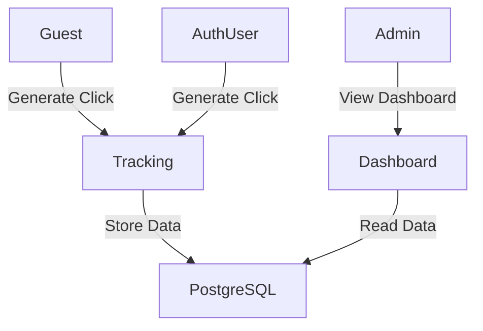
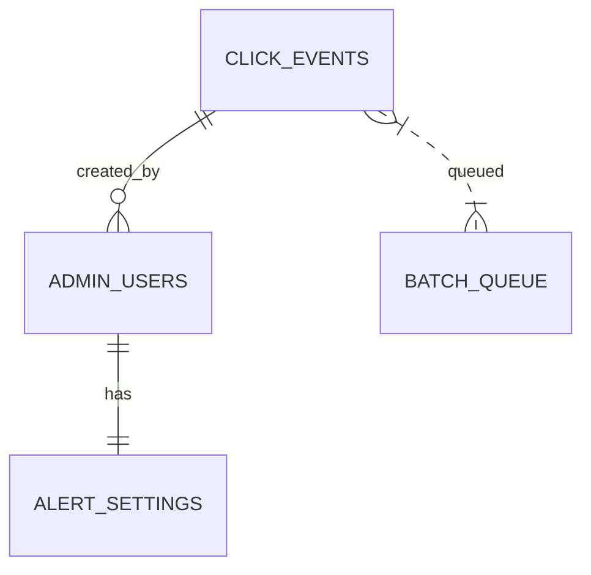

# Add new Feature for tracking User

_Generated 2026-09-12T14:20:28.161Z_

## Product Idea

feature ini di gunakan untuk mentracking button apa aja yang di click user, jika user login tampilan nama nya, jika user belum login gunakan ip address,

semua button link harus di tracking, terdapat dashboard yang digunakan untuk melihat aktivitas user oleh admin, dari lokasi, kapan, dengan browser apa seperti google analitict.

## Project Metadata

- **Status:** IN_PROGRESS
- **Platform:** WEB
- **Target users:** Anyone
- **Industry:** Tennis
- **Preferred tech:** NextJs, SupaBase, Postgree SQL

## Requirements

- [SCOPE · USER · 80%] Melacak semua klik tombol pada situs web
- [SCOPE · USER · 80%] Jika pengguna sudah login, mencatat nama pengguna
- [SCOPE · USER · 80%] Jika pengguna belum login, mencatat alamat IP pengguna
- [SCOPE · USER · 80%] Merekam data lokasi, waktu, dan browser yang digunakan saat klik
- [SCOPE · USER · 80%] Menyediakan dashboard untuk admin melihat aktivitas pengguna (lokasi, waktu, browser) mirip Google Analytics
- [SCOPE · USER · 80%] Dashboard menampilkan detail setiap tombol yang diklik
- [SCOPE · USER · 80%] Platform target adalah web
- [SCOPE · USER · 80%] Menggunakan teknologi NextJs, Supabase, dan PostgreSQL

## PRD (v10)

### Gambaran Produk

### Gambaran Produk

Sistem **Click‑Tracking** ini mencatat setiap interaksi klik pada semua elemen yang dapat diklik (button, link, div, iframe) di situs web tenis. Data yang dikumpulkan meliputi:

- **Identitas pengguna**:  
  - Jika pengguna sudah login → `username`  
  - Jika belum login → alamat **IP** (plain text)
- **Detail klik**: teks tombol, tipe elemen, URL tujuan, timestamp (zona waktu browser), kota (geolokasi IP atau API browser), browser / User‑Agent, tipe perangkat, referrer URL.
- **Penyimpanan**: baris klik disimpan dalam tabel PostgreSQL melalui Supabase RPC dengan **batch insert per menit** (maks 1 000 klik/menit). Setiap baris memiliki **UUID v4** sebagai `click_id`. Pada kegagalan batch, sistem otomatis melakukan retry hingga 3 kali.
- **Dashboard Admin**: antarmuka web real‑time yang menampilkan tabel klik dengan infinite scroll, filter, sorting, dan agregasi total klik per tombol per hari. Sistem mengirimkan **alert email** bila volume klik melebihi 800 per menit.
- **Keamanan & Privasi**: IP disimpan dalam plain text, tidak dienkripsi atau di‑hash; tidak ada mekanisme consent, penghapusan data, atau retensi terbatas.

#### Alur Data (Mermaid)

```mermaid
flowchart TD
    A[Halaman dimuat] --> B[Event delegation pasang listener]
    B --> C[Klik terdeteksi]
    C --> D[Ambil data (username/IP, lokasi, dll.)]
    D --> E[Masukkan ke queue batch]
    E -->|Setiap menit| F[Supabase RPC bulk insert]
    F --> G[Data tersimpan di PostgreSQL]
    G --> H[Dashboard menampilkan update real‑time]
    F -->|>800 klik/menit| I[Trigger alert email]
```

### Tujuan

### Tujuan

1. **Merekam 100 % klik** pada semua elemen yang dapat diklik, termasuk yang dibuat secara dinamis dan yang berada dalam iframe.  
2. **Identifikasi pengguna** secara otomatis: nama pengguna bila login, atau alamat IP bila anonim.  
3. **Menyimpan data lengkap** per klik (teks tombol, tipe elemen, URL tujuan, timestamp, kota, browser, device type, referrer) dalam PostgreSQL dengan **batch per menit**.  
4. **Menampilkan data secara real‑time** pada dashboard admin dengan:
   - tabel infinite scroll,
   - filter tanggal, lokasi, browser, nama tombol, URL tujuan,
   - sorting pada kolom Nama Tombol, URL Tujuan, Waktu,
   - agregasi total klik per tombol per hari.
5. **Mendeteksi dan mengabaikan** klik yang berasal dari bot/crawler berdasarkan User‑Agent yang dikenal.  
6. **Mengirimkan alert email** otomatis bila volume klik melebihi 800 per menit.  
7. **Menjamin keandalan** proses batch dengan retry otomatis hingga 3 kali sebelum menandai kegagalan.  
8. **Mendukung volume maksimum < 1 000 klik/menit** tanpa menurunkan performa sistem.

### Bukan Tujuan

### Bukan Tujuan

- Menyediakan fitur **heatmap** visualisasi klik per halaman.  
- Menyediakan **ekspor data ke CSV** atau format lain.  
- Menyimpan atau menampilkan **riwayat klik** untuk pengguna individu.  
- Mengimplementasikan **persetujuan (consent) pengguna** atau mekanisme **penghapusan data** sesuai regulasi privasi.  
- Menyediakan **peran admin tambahan** dengan tingkat izin berbeda atau **autentikasi dua faktor (2FA)**.  
- Melacak **elemen non‑HTML** seperti canvas atau SVG.  
- Melacak klik pada **Web Components** yang dirender secara dinamis.  
- Menggunakan layanan **geolokasi eksternal**; lokasi diperoleh secara internal (self‑hosted).  
- Menyimpan IP dalam bentuk **hash atau mask** setelah periode tertentu.  
- Menyediakan **visualisasi agregat** selain total klik per tombol per hari (misalnya funnel, cohort).  
- Menyediakan **paginasi tradisional**; dashboard menggunakan infinite scroll.  
- Menyimpan data dengan **retensi terbatas**; data disimpan tanpa batas waktu.  
- Mengirimkan notifikasi melalui saluran selain **email** (misalnya Slack, SMS).  
- Menyediakan **monitoring alert** untuk ambang selain 800 klik/menit.

### Pengguna Sasaran

## Target Users (Pengguna Sasaran)

- **Pengunjung umum** situs web tenis, baik yang sudah **login** maupun yang **anonim**.
- **Pemain tenis**, pelatih, dan penggemar yang mengakses konten artikel, jadwal pertandingan, atau toko peralatan.
- **Administrator** situs yang membutuhkan insight real‑time tentang interaksi pengguna untuk:
  - Mengoptimalkan tata letak UI/UX.
  - Memantau popularitas fitur.
  - Mengidentifikasi potensi penyalahgunaan atau bot.

Tidak ada batasan usia atau wilayah geografis; sistem dirancang untuk melayani semua pengunjung yang mengakses melalui browser web desktop atau mobile.

### Peran Pengguna

## User Roles (Peran Pengguna)

```text
Admin
└─ Dashboard Analitik (akses penuh)
```

Only one role: **Admin**. All other visitors are **Guest** (no login) or **Authenticated User** (login) but they do not have any UI permissions beyond generating click events.



### Fitur

## Features (Fitur)

1. **Pelacakan Semua Klik Elemen**
   - Menangkap klik pada **button, link, div, iframe, dan elemen HTML lain** menggunakan **event delegation**.
   - Identifikasi unik: `teks tombol + tipe elemen`.

2. **Identifikasi Pengguna**
   - Jika **login** → simpan `username`.
   - Jika **anonim** → simpan `IP address` (plain text).

3. **Enrichment Data**
   - **Waktu klik** disimpan dalam zona waktu browser pengguna.
   - **Lokasi (kota)** diperoleh dari geolokasi IP (self‑hosted) atau API browser.
   - **Browser / User‑Agent**, **Device type**, **Referrer URL**.

4. **Batching & Penyimpanan**
   - Event dikumpulkan dalam **queue memori** selama **≤ 1 menit**.
   - Setiap menit, **bulk insert** ke PostgreSQL via **Supabase RPC** (UUID v4 sebagai primary key).
   - **Retry otomatis** hingga 3 kali bila insert gagal.

5. **Dashboard Admin Real‑time**
   - Tabel dengan **infinite scroll**, kolom: Nama Tombol, URL Tujuan, Waktu Klik, Lokasi (kota), Browser/User‑Agent, Device type, Referrer URL.
   - **Filter**: Tanggal, Lokasi, Browser, Nama Tombol, URL tujuan.
   - **Sorting**: Nama Tombol, URL tujuan, Waktu.
   - **Agregasi harian**: total klik per tombol.
   - **Alert** via email bila **> 800 klik/menit**.

6. **Keamanan & Privasi**
   - IP disimpan dalam **plain text**, tidak di‑hash atau enkripsi.
   - Tidak ada mekanisme **consent** atau **permintaan penghapusan** data.
   - Akses dashboard dibatasi hanya untuk **admin** yang terautentikasi (tanpa 2FA).

7. **Bot Detection**
   - Mengabaikan event yang memiliki **User‑Agent** dikenal sebagai bot/crawler.

8. **Monitoring & Observability**
   - Metric: klik per menit, batch insert latency, retry count.
   - Alert email ke tim operasional bila ambang tercapai.

```mermaid
flowchart LR
    A[Page Load] --> B[Event Delegation Listener]
    B --> C[Capture Click Event]
    C --> D{User Logged In?}
    D -->|Ya| E[Attach Username]
    D -->|Tidak| F[Attach IP Address]
    E --> G[Enrich dengan Geo, Browser, Device]
    F --> G
    G --> H[Push ke Batch Queue]
    H --> I{Timer 1 menit atau batch full}
    I -->|Trigger| J[Supabase RPC Bulk Insert]
    J --> K[PostgreSQL Click Table]
    K --> L[Dashboard Query (Real‑time)]
    L --> M[Admin View]
```

### Cerita Pengguna

## User Stories

### 1. Admin melihat detail klik per tombol
**Sebagai** Admin  
**Saya ingin** melihat daftar semua klik yang terjadi pada setiap tombol, lengkap dengan kolom Nama Tombol, URL Tujuan, Waktu Klik, Lokasi (kota), Browser/User-Agent, Device Type, Referrer URL  
**Sehingga** saya dapat menganalisis perilaku pengguna.

**Acceptance Criteria**
- **Given** admin sudah login dan berada di halaman Dashboard  
- **When** admin membuka tab *Klik Detail*  
- **Then** tabel menampilkan semua kolom di atas, dapat di‑sort pada Nama Tombol, URL Tujuan, dan Waktu, serta mendukung infinite scroll.

### 2. Sistem mencatat klik pada semua elemen yang dapat diklik
**Sebagai** Sistem  
**Saya ingin** secara otomatis menangkap setiap klik pada tombol, link, div, atau elemen lain yang dapat diklik, termasuk yang berada dalam iframe dan yang dibuat secara dinamis setelah halaman dimuat  
**Sehingga** tidak ada interaksi yang terlewat.

**Acceptance Criteria**
- **Given** halaman web sudah dimuat  
- **When** pengguna mengklik elemen apa pun yang memiliki event `click` (termasuk elemen dalam iframe)  
- **Then** event dikumpulkan dengan data: teks tombol, tipe elemen, URL tujuan, timestamp (waktu browser), IP atau username, kota, browser, device type, referrer URL, dan UUID v4.

### 3. Sistem menyimpan data klik secara batch per menit
**Sebagai** Sistem  
**Saya ingin** mengirimkan kumpulan event klik ke Supabase setiap menit (atau lebih cepat bila batch sudah mencapai ukuran tertentu)  
**Sehingga** beban database tetap optimal.

**Acceptance Criteria**
- **Given** ada satu atau lebih event yang belum tersimpan  
- **When** timer 60 detik selesai atau batch mencapai 500 record  
- **Then** sistem melakukan bulk‑insert via Supabase RPC; bila gagal, otomatis retry hingga 3 kali sebelum menandai error.

### 4. Sistem mengirim alert email bila volume klik > 800 per menit
**Sebagai** Sistem  
**Saya ingin** mengirim notifikasi email ke tim operasional bila jumlah klik dalam satu menit melebihi 800  
**Sehingga** mereka dapat menindaklanjuti potensi overload.

**Acceptance Criteria**
- **Given** counter klik per menit mencapai 801  
- **When** menit berakhir  
- **Then** email alert dikirim ke alamat yang telah dikonfigurasi.

### 5. Admin melihat agregasi total klik per tombol per hari
**Sebagai** Admin  
**Saya ingin** melihat total klik tiap tombol yang teragregasi per hari  
**Sehingga** dapat mengidentifikasi tombol paling efektif.

**Acceptance Criteria**
- **Given** admin berada di tab *Agregasi Harian*  
- **When** memilih rentang tanggal  
- **Then** tabel menampilkan kolom Nama Tombol, Tanggal, Total Klik, dan dapat di‑export ke PDF (opsional, tidak wajib).

### Kebutuhan Fungsional

## Functional Requirements

1. **Event Capture**
   - Implement event delegation on `document` to capture `click` events from all clickable elements (`button`, `a`, `[role="button"]`, `div`, `span`, iframe content).
   - For dynamically added elements, the delegated listener must remain active.
   - Capture the following attributes for each event:
     - `uuid` (UUID v4)
     - `button_text` (innerText trimmed)
     - `element_type` (e.g., `button`, `a`, `div`, `iframe`)
     - `target_url` (href or form action)
     - `timestamp` (browser local time, ISO‑8601)
     - `user_identifier` (`username` if logged‑in, otherwise IP address)
     - `city` (derived from IP via self‑hosted geolocation DB)
     - `browser_user_agent`
     - `device_type` (mobile/desktop/tablet)
     - `referrer_url`
2. **User Identification**
   - Use existing Supabase auth session to obtain `username`.
   - If no session, retrieve client IP from request header `x-forwarded-for` (via edge function) and store as plain text.
3. **Batch Processing**
   - Events are queued in an in‑memory buffer on the client.
   - Every minute (or when buffer ≥ 500 records) invoke Supabase RPC `insert_click_events_bulk(events JSON[])`.
   - RPC performs a single `INSERT ... VALUES` statement.
   - On failure, retry up to 3 times with exponential back‑off (2 s, 4 s, 8 s). After 3 attempts, log error to Supabase `error_logs` table.
4. **Real‑time Dashboard**
   - Supabase Realtime channel `click_events` streams newly inserted rows to the admin UI.
   - Dashboard subscribes to this channel and updates the table instantly.
5. **Filtering & Sorting**
   - API endpoint `/api/click-events` supports query parameters: `start_date`, `end_date`, `city`, `browser`, `button_text`, `target_url`.
   - Sorting allowed on `button_text`, `target_url`, `timestamp`.
6. **Pagination**
   - Infinite scroll implemented on the client; backend returns `limit` (default 100) and `offset`.
7. **Aggregation**
   - Supabase view `daily_button_clicks` calculates `COUNT(*)` grouped by `button_text` and `date`.
   - Endpoint `/api/daily-aggregates` returns the view data.
8. **Alerting**
   - Edge function runs every minute, counts rows inserted in the last minute.
   - If count > 800, send email via SendGrid (or SMTP) to `ops@domain.com`.
9. **Bot Detection**
   - Before queuing, inspect `navigator.userAgent`. If it matches known bot patterns (`Googlebot`, `Bingbot`, `Yahoo! Slurp`, etc.), discard the event.
10. **Iframe Support**
    - Inject a tiny script into allowed iframes (same‑origin) that forwards click events to the parent via `postMessage`. Parent listener treats them as regular events.
11. **Data Retention**
    - No automatic purge; rows remain indefinitely unless manually deleted by admin (feature not exposed).
12. **Security & Privacy**
    - IP stored as plain text; no hashing or masking.
    - All API routes require Supabase JWT with role `admin` for read access; write access is public (no auth) because click data is non‑personal.
13. **Timezone Handling**
    - Timestamps stored as received from the browser (local time) and also as UTC (`timestamp_utc`) for consistency.
14. **Monitoring**
    - Export Prometheus metrics: `clicks_per_minute`, `batch_insert_success`, `batch_insert_failure`, `alert_sent`.

### Kebutuhan Non‑Fungsional

## Non‑Functional Requirements

| Area | Requirement | Rationale |
|------|-------------|-----------|
| **Performance** | System must handle up to **1.000 klik per menit** without degradation. | Ensures smooth user experience and prevents backlog. |
| **Scalability** | Architecture based on stateless Next.js front‑end and Supabase serverless functions; can scale horizontally. | Allows future growth beyond current volume. |
| **Availability** | Dashboard and API must have **99.9 % uptime** (excluding scheduled maintenance). | Critical for admin monitoring. |
| **Reliability** | Batch insert retries up to 3 times; if still failing, error logged and alert sent. | Guarantees data integrity. |
| **Latency** | Real‑time updates on dashboard must appear within **2 seconds** of successful insert. | Provides near‑instant feedback similar to Google Analytics. |
| **Security** | All communication over HTTPS. Supabase JWT validation for admin endpoints. No encryption of IP (as per rule). | Meets basic security while respecting privacy rule. |
| **Privacy** | No user consent required; IP stored in plain text; no GDPR‑mandated masking. | Aligns with business rules. |
| **Maintainability** | Codebase organized into modules: `tracking.js`, `batchProcessor.js`, `api/`, `dashboard/`. Unit tests coverage ≥ 80 %. | Facilitates future enhancements. |
| **Observability** | Metrics exported to Prometheus; alerts via email when `clicks_per_minute > 800`. | Enables operations team to react quickly. |
| **Backup & Recovery** | Supabase automated daily backups; retention 30 days. | Protects against data loss. |
| **Compatibility** | Works on modern browsers (Chrome, Firefox, Safari, Edge) and degrades gracefully on older versions. | Broad user reach. |
| **Internationalization** | UI strings stored in i18n JSON; default language Indonesian. | Supports local market. |
| **Compliance** | No GDPR‑required data deletion or masking; documented in policy. | Matches business constraints. |

### Aturan Bisnis

## Aturan Bisnis

- **Identifikasi Pengguna**
  - Jika pengguna sudah login, simpan `username` (plain text).
  - Jika pengguna belum login, simpan alamat IP dalam bentuk plain text (tidak di‑hash atau enkripsi).

- **Penyimpanan Data**
  - Semua data klik disimpan selamanya (retensi tidak terbatas).
  - Tidak ada mekanisme penghapusan data atas permintaan pengguna.
  - Tidak diperlukan persetujuan (consent) sebelum mengumpulkan data klik.

- **Privasi & Keamanan**
  - Alamat IP disimpan dalam plain text; tidak ada masking, hashing, atau enkripsi.
  - Data tidak dibagikan ke pihak ketiga.
  - Dashboard hanya dapat diakses oleh satu peran **Admin** yang telah terotorisasi.

- **Pengelolaan Data**
  - Batch insert dilakukan setiap menit; bila batch gagal, sistem melakukan retry otomatis hingga 3 kali.
  - Jika volume klik melebihi **800 klik per menit**, sistem mengirimkan alert via email ke admin.

- **Penggunaan Data**
  - Data digunakan untuk analisis internal: laporan harian total klik per tombol, distribusi geografis, dan tren browser.
  - Tidak ada fitur ekspor CSV atau integrasi dengan alat analitik eksternal.

- **Kebijakan Bot**
  - Klik yang berasal dari user‑agent yang dikenali sebagai bot atau crawler diabaikan dan tidak disimpan.


### Alur Pengguna

## Alur Pengguna (User Flow)

```mermaid
flowchart TD
    A[Pengunjung membuka halaman] --> B[Script tracking di‑inject oleh Next.js]
    B --> C{Apakah elemen dapat diklik?}
    C -- Ya --> D[Event delegation menangkap klik]
    D --> E{Pengguna login?}
    E -- Ya --> F[Ambil username]
    E -- Tidak --> G[Ambil IP address]
    F --> H[Kumpulkan data: button text, element type, target URL, timestamp, browser, device, referrer, city (via geolokasi IP atau API browser)]
    G --> H
    H --> I[Masukkan ke queue batch (Redis/Memory)]
    I --> J{Apakah sudah 1 menit atau batch size tercapai?}
    J -- Ya --> K[Bulk insert via Supabase RPC (UUID v4)]
    K --> L{Insert berhasil?}
    L -- Ya --> M[Data tersedia untuk dashboard]
    L -- Tidak --> N[Retry otomatis (max 3 kali)]
    N --> K
    J -- Tidak --> O[Menunggu]
    O --> I
    M --> P[Admin membuka dashboard]
    P --> Q[Dashboard menampilkan tabel klik dengan filter & sorting]
    Q --> R[Jika klik > 800/min, kirim email alert]
```


### Arsitektur Informasi

## Arsitektur Informasi

```
src/
├─ pages/
│   ├─ index.tsx                # Halaman utama
│   ├─ _app.tsx                 # Inisialisasi tracking library
│   └─ admin/
│       └─ dashboard.tsx        # UI dashboard admin
├─ components/
│   ├─ TrackingProvider.tsx     # Context untuk event delegation
│   └─ ClickTable.tsx           # Tabel hasil klik (infinite scroll)
└─ lib/
    ├─ api/
    │   ├─ click.ts             # Endpoint POST /api/click
    │   └─ batchInsert.ts       # RPC bulk insert ke Supabase
    └─ utils/
        ├─ geo.ts                # Geolokasi IP (self‑hosted)
        └─ botDetect.ts          # Deteksi user‑agent bot

supabase/
├─ functions/
│   └─ bulkInsert.sql           # RPC untuk insert bulk
└─ tables/
    ├─ clicks/
    │   ├─ id (uuid PK)
    │   ├─ button_text (text)
    │   ├─ element_type (text)
    │   ├─ target_url (text)
    │   ├─ timestamp (timestamptz)
    │   ├─ ip_address (text)
    │   ├─ username (text nullable)
    │   ├─ city (text)
    │   ├─ browser (text)
    │   ├─ device_type (text)
    │   └─ referrer_url (text)
    └─ admins/
        ├─ id (uuid PK)
        └─ email (text)
```

### Spesifikasi Layar

# Screen Specifications

## Dashboard Admin – Halaman Utama

- **Layout**: Single‑page application dengan sidebar kiri (navigasi) dan area konten utama.
- **Navigasi Sidebar**:
  - Dashboard (default)
  - Agregasi Harian
  - Pengaturan Alert
  - Profil Admin
- **Area Konten Utama**:
  - **Header**: Judul halaman, tombol refresh manual, indikator status koneksi real‑time (green/red).
  - **Filter Bar** (horizontal di atas tabel):
    - Tanggal (date picker range)
    - Lokasi (dropdown multi‑select – kota)
    - Browser/User‑Agent (dropdown multi‑select)
    - Nama Tombol (input text autocomplete)
    - URL Tujuan (input text)
    - Tombol **Apply Filters** dan **Reset**
  - **Tabel Klik**:
    - Implementasi **infinite scroll** (load next batch saat scroll ke bawah).
    - Kolom (dalam urutan):
      1. **Nama Tombol** (button_text)
      2. **Tipe Elemen** (element_type) – contoh: `button`, `a`, `div`
      3. **URL Tujuan** (target_url)
      4. **Waktu Klik** (timestamp) – ditampilkan dalam zona waktu pengguna (browser).
      5. **Lokasi (Kota)** (city)
      6. **Browser / User‑Agent** (browser)
      7. **Device Type** (device_type)
      8. **Referrer URL** (referrer_url)
    - **Sorting**: Klik pada header kolom untuk urutkan naik/turun. Kolom yang dapat disortir: Nama Tombol, URL Tujuan, Waktu Klik.
    - **Row Action**: Hover menampilkan ikon “Detail” yang membuka modal dengan semua data mentah event (termasuk IP dan username bila ada).
  - **Footer**: Total baris yang ditampilkan, tombol “Load More” (fallback jika infinite scroll tidak didukung).

## Dashboard Admin – Tab Agregasi Harian

- **Grafik Bar**: Total klik per tombol per hari (x‑axis: tanggal, y‑axis: jumlah klik, series per tombol).
- **Tabel Ringkasan**: Kolom Nama Tombol, Total Klik Hari Ini, Total Klik 7 Hari Terakhir.
- **Filter**: Sama seperti pada halaman utama, tetapi berlaku pada data agregasi.

## Pengaturan Alert

- **Form**: Input ambang batas klik per menit (default 800).
- **Toggle**: Aktifkan/Nonaktifkan notifikasi email.
- **Email Tujuan**: Input email admin.
- **Status**: Indikator apakah alert sedang aktif.

## Modal Detail Event

- **Header**: UUID Klik, Timestamp.
- **Body**: Tabel dua kolom menampilkan semua atribut event (button_text, element_type, target_url, ip, username, city, browser, device_type, referrer_url).
- **Footer**: Tombol Close.

```mermaid
graph LR
    A[Sidebar] --> B[Dashboard Utama]
    B --> C[Filter Bar]
    B --> D[Tabel Klik (Infinite Scroll)]
    D --> E[Modal Detail]
    A --> F[Tab Agregasi]
    F --> G[Grafik Bar]
    F --> H[Tabel Ringkasan]
    A --> I[Pengaturan Alert]
    I --> J[Form Ambang & Email]
```


### Kebutuhan API

# API Requirements

## 1. Endpoint Pengiriman Event Klik
- **Method**: `POST`
- **URL**: `/api/click-event`
- **Auth**: Token Supabase (Bearer) – wajib untuk semua request (meskipun user anonim, token publik masih diperlukan).
- **Request Body (JSON)**:
  ```json
  {
    "button_text": "string",
    "element_type": "string",   // button, a, div, etc.
    "target_url": "string",
    "timestamp": "ISO8601 string", // waktu browser
    "ip": "string",
    "username": "string|null",
    "city": "string",
    "browser": "string",
    "device_type": "string",
    "referrer_url": "string"
  }
  ```
- **Response**: `202 Accepted` dengan body `{ "status": "queued" }`.
- **Error Codes**:
  - `400 Bad Request` – payload tidak valid.
  - `401 Unauthorized` – token tidak ada/invalid.
  - `429 Too Many Requests` – rate limit 2000 req/menit per IP.

## 2. Batch Insert RPC (Supabase)
- **Function Name**: `insert_click_events_batch`
- **Trigger**: Scheduler setiap menit atau ketika queue mencapai 500 record.
- **Input**: Array of JSON objects (same schema as above).
- **Behavior**:
  - Insert bulk menggunakan `INSERT ... VALUES` dengan `ON CONFLICT DO NOTHING`.
  - Return count of inserted rows.
  - Retry otomatis hingga 3 kali pada kegagalan DB/network.

## 3. Ambil Data Klik untuk Dashboard
- **Method**: `GET`
- **URL**: `/api/dashboard/clicks`
- **Auth**: Supabase session – hanya admin.
- **Query Parameters** (all optional):
  - `start_date` (ISO date)
  - `end_date` (ISO date)
  - `city` (comma‑separated list)
  - `browser` (comma‑separated list)
  - `button_text` (partial match)
  - `target_url` (partial match)
  - `limit` (default 100, max 1000)
  - `offset` (for pagination – used by infinite scroll)
- **Response**: JSON array of click records ordered by `timestamp DESC`.

## 4. Ambil Data Agregasi Harian
- **Method**: `GET`
- **URL**: `/api/dashboard/aggregations/daily`
- **Auth**: Admin only.
- **Query Parameters**:
  - `date` (ISO date) – hari yang diminta.
- **Response**:
  ```json
  [
    { "button_text": "Daftar", "click_count": 124 },
    { "button_text": "Beli Tiket", "click_count": 87 }
  ]
  ```

## 5. Pengaturan Alert (CRUD sederhana)
- **Method**: `GET /api/alert/settings`
- **Method**: `POST /api/alert/settings`
- **Body**:
  ```json
  { "threshold_per_minute": 800, "email": "admin@example.com", "enabled": true }
  ```
- **Auth**: Admin only.

## 6. Health Check
- **Method**: `GET`
- **URL**: `/api/health`
- **Response**: `{ "status": "ok" }`

## Non‑Functional API Requirements
- **Rate Limiting**: 2000 requests per minute per IP.
- **Timeout**: 5 seconds per request.
- **Logging**: Semua request dan response status dicatat ke Supabase logs.
- **Versioning**: v1 (`/api/v1/...`).


### Model Data

# Data Model

## 1. Tabel `click_events`
| Column | Type | Constraints | Description |
|--------|------|-------------|-------------|
| `id` | `uuid` | Primary Key, Default `gen_random_uuid()` | ID unik per event (UUID v4) |
| `button_text` | `text` | Not null | Teks tombol yang diklik |
| `element_type` | `text` | Not null | Tipe elemen HTML (button, a, div, etc.) |
| `target_url` | `text` | Not null | URL tujuan atau `href` yang terkait |
| `timestamp` | `timestamptz` | Not null | Waktu klik (dari browser, disimpan dengan zona waktu pengguna) |
| `ip` | `inet` | Not null | Alamat IP pengguna (plain text) |
| `username` | `text` | Nullable | Nama pengguna bila sudah login |
| `city` | `text` | Nullable | Kota hasil geolokasi IP atau browser |
| `browser` | `text` | Not null | User‑Agent string atau nama browser |
| `device_type` | `text` | Not null | `desktop`, `mobile`, `tablet`, dll |
| `referrer_url` | `text` | Nullable | URL referrer saat klik terjadi |
| `created_at` | `timestamptz` | Default `now()` | Timestamp penyimpanan batch |

**Indexes**:
- `idx_click_events_timestamp` on `timestamp`
- `idx_click_events_button_text` on `button_text`
- `idx_click_events_city` on `city`
- `idx_click_events_browser` on `browser`
- Composite index `(timestamp, city, browser)` untuk filter dashboard.

## 2. Tabel `admin_users`
| Column | Type | Constraints | Description |
|--------|------|-------------|-------------|
| `id` | `uuid` | Primary Key, Default `gen_random_uuid()` |
| `email` | `text` | Unique, Not null |
| `password_hash` | `text` | Not null |
| `created_at` | `timestamptz` | Default `now()` |
| `is_active` | `boolean` | Default `true` |

## 3. Tabel `alert_settings`
| Column | Type | Constraints | Description |
|--------|------|-------------|-------------|
| `id` | `int` | Primary Key |
| `threshold_per_minute` | `int` | Not null, Default `800` |
| `email` | `text` | Not null |
| `enabled` | `boolean` | Default `true` |
| `updated_at` | `timestamptz` | Default `now()` |

## 4. Tabel `batch_queue` (opsional, untuk menampung event sebelum RPC)
| Column | Type | Constraints | Description |
|--------|------|-------------|-------------|
| `id` | `bigserial` | Primary Key |
| `payload` | `jsonb` | Not null |
| `queued_at` | `timestamptz` | Default `now()` |
| `processed` | `boolean` | Default `false` |

**Relationship Diagram**


## Retention & Privacy
- Data tidak di‑hapus otomatis (retensi tak terbatas).
- IP disimpan dalam bentuk plain text, tidak di‑hash atau di‑mask.
- Tidak ada mekanisme permintaan penghapusan data oleh pengguna.


### Analitik

## Analitik

### Metrik Utama
- **Total Klik per Tombol per Hari** – jumlah klik unik (berdasarkan UUID) untuk setiap teks tombol + tipe elemen dalam rentang 24 jam.
- **Klik per Menit (RPM)** – jumlah klik yang diproses dalam batch per menit; digunakan untuk memicu alert bila > 800.
- **Distribusi Geografis** – persentase klik per kota.
- **Distribusi Browser / User‑Agent** – persentase klik per browser utama (Chrome, Safari, Firefox, Edge, dll.).
- **Device Type** – persentase klik dari desktop vs mobile.
- **Referrer URL** – top 10 URL yang mengarahkan klik ke situs.

### Dashboard Visual
- Tabel interaktif dengan infinite scroll menampilkan kolom: Nama Tombol, URL Tujuan, Waktu Klik, Lokasi (kota), Browser/User‑Agent, Device Type, Referrer URL.
- Filter dinamis: Tanggal, Lokasi, Browser, Nama Tombol, URL Tujuan.
- Sorting pada kolom Nama Tombol, URL Tujuan, Waktu.
- Ringkasan agregasi di atas tabel:
  - Total Klik Hari Ini
  - Klik per Menit (grafik lini)
  - Top 5 Tombol dengan klik terbanyak
  - Top 5 Kota

### Proses Analitik (Mermaid)

```mermaid
flowchart TD
    A[Browser – Event Delegation] --> B[Capture Click Event]
    B --> C{User Logged In?}
    C -- Ya --> D[Ambil username]
    C -- Tidak --> E[Ambil IP address]
    D --> F[Enrich dengan GeoIP (self‑hosted) → City]
    E --> F
    F --> G[Detect Browser & Device]
    G --> H[Queue ke Batch Buffer (1 menit)]
    H --> I[Supabase RPC Bulk Insert]
    I --> J[PostgreSQL tabel click_events]
    J --> K[Realtime Subscription (Supabase) → Dashboard]
    K --> L[Analytics Engine (SQL Views & Materialized Views)]
    L --> M[Dashboard UI]
```

### Penyimpanan & Retensi
- Semua data disimpan selamanya (tidak ada penghapusan otomatis).
- Timestamp disimpan dalam zona waktu pengguna (browser) sebagai `timestamptz`.
- City disimpan sebagai teks (hasil self‑hosted GeoIP).

### Alert & Monitoring
- Query terjadwal setiap menit menghitung `RPM`.
- Jika `RPM > 800` → kirim email alert ke admin.


### Kriteria Penerimaan

## Kriteria Penerimaan

### 1. Perekaman Klik
**Given** pengguna berada di halaman web mana pun dan elemen yang dapat diklik (tombol, link, div, iframe) sudah ter‑render.
**When** pengguna mengklik elemen tersebut.
**Then** sistem harus mencatat event dengan data berikut dalam batch buffer:
- UUID v4 unik
- Teks tombol
- Tipe elemen (button, a, div, iframe)
- URL tujuan (jika ada)
- Timestamp dalam zona waktu browser
- IP address (plain text) atau username bila sudah login
- Kota (hasil GeoIP self‑hosted)
- Browser/User‑Agent
- Device type
- Referrer URL

### 2. Identifikasi Pengguna
**Given** pengguna sudah login melalui Supabase Auth.
**When** klik terjadi.
**Then** nama pengguna harus disimpan di kolom `username` dan kolom `ip_address` dibiarkan kosong.

**Given** pengguna belum login.
**When** klik terjadi.
**Then** kolom `username` kosong dan kolom `ip_address` berisi alamat IP publik.

### 3. Batch Insert per Menit
**Given** ada satu atau lebih event klik dalam buffer.
**When** satu menit berlalu atau buffer mencapai ukuran maksimum.
**Then** sistem harus mengeksekusi RPC `bulk_insert_clicks` ke Supabase dengan semua record sekaligus.

### 4. Retry Batch Insert
**Given** RPC bulk insert gagal karena error jaringan atau DB.
**When** kegagalan terdeteksi.
**Then** sistem harus otomatis melakukan retry hingga maksimal 3 kali dengan jeda eksponensial.

### 5. Real‑time Dashboard Update
**Given** admin sudah masuk ke dashboard dan memiliki koneksi Supabase realtime aktif.
**When** batch insert berhasil.
**Then** data baru harus muncul di tabel dashboard dalam ≤ 5 detik tanpa refresh manual.

### 6. Filter & Sorting
**Given** admin berada di halaman tabel klik.
**When** admin memilih filter tanggal, lokasi, browser, nama tombol, atau URL tujuan.
**Then** tabel harus menampilkan hanya record yang memenuhi kriteria filter.
**And** admin dapat meng‑sort kolom Nama Tombol, URL Tujuan, atau Waktu secara ascending/descending.

### 7. Agregasi Harian per Tombol
**Given** ada setidaknya satu klik pada suatu tombol dalam 24 jam terakhir.
**When** admin membuka panel "Ringkasan Harian".
**Then** sistem harus menampilkan total klik per tombol untuk hari tersebut.

### 8. Alert Volume Tinggi
**Given** jumlah klik yang diproses dalam satu menit melebihi 800.
**When** query monitoring mendeteksi kondisi ini.
**Then** sistem harus mengirim email ke alamat admin yang dikonfigurasi dengan subjek "High Click Volume Alert".

### 9. Ignoring Bot Clicks
**Given** request datang dengan User‑Agent yang termasuk dalam daftar known bots.
**When** event klik diproses.
**Then** event tersebut harus diabaikan dan tidak disimpan ke buffer.

### 10. Infinite Scroll
**Given** admin menggulir ke bawah tabel hingga mencapai akhir halaman.
**When** scroll mencapai 90% dari tinggi konten.
**Then** sistem harus memuat batch berikutnya secara otomatis (lazy load) dan menambahkannya ke tabel.

### 11. Keamanan & Otorisasi
**Given** ada request API untuk mengambil data klik.
**When** token JWT Supabase tidak memiliki role `admin`.
**Then** API harus mengembalikan HTTP 403 Forbidden.

### 12. Penyimpanan ID Klik
**Given** sebuah event klik berhasil disimpan.
**When** dilihat di database.
**Then** kolom `id` harus berisi nilai UUID v4 yang unik.


### Tugas Pengembangan

## Tugas Pengembangan

### A. Persiapan Infrastruktur
1. **Setup Supabase Project**
   - Buat proyek Supabase dengan autentikasi, storage, dan Realtime.
   - Aktifkan PostgreSQL extensions yang diperlukan (uuid‑ossp).
2. **Deploy Self‑Hosted GeoIP Service**
   - Pilih database GeoIP (mis. MaxMind DB) dan expose API lokal `/geoip/:ip` yang mengembalikan nama kota.
3. **Konfigurasi CI/CD**
   - Tambahkan pipeline GitHub Actions untuk linting, unit test, dan deployment ke Vercel (Next.js) serta Supabase.

### B. Implementasi Front‑end Tracking (Next.js)
1. **Buat Library `useClickTracker`**
   - Menggunakan `useEffect` untuk menambahkan event listener `click` pada `document` (event delegation).
   - Filter elemen yang dapat diklik: `button`, `a`, `[role="button"]`, `div[onclick]`, `iframe`.
   - Ekstrak teks tombol (`innerText.trim()`), tipe elemen, dan `href`/`action` bila ada.
2. **Identifikasi Pengguna**
   - Integrasi dengan Supabase Auth (`supabase.auth.getUser()`).
   - Jika ada `user`, ambil `username`; bila tidak, ambil IP via endpoint `/api/get-ip` (fetch ke Vercel Edge Function).
3. **Enrich Data**
   - Panggil endpoint self‑hosted GeoIP untuk mendapatkan `city`.
   - Dapatkan `navigator.userAgent` untuk browser & device detection (simple regex).
   - Dapatkan `document.referrer`.
4. **Batch Queue**
   - Simpan objek event ke array global `clickBuffer`.
   - Set interval 60 detik: jika `clickBuffer.length > 0` → panggil RPC `bulk_insert_clicks`.
   - Implementasikan exponential back‑off untuk retry (max 3).
5. **Bot Filtering**
   - Daftar User‑Agent known bots (Googlebot, Bingbot, dll.).
   - Jika `navigator.userAgent` match, abaikan event.

### C. Supabase RPC & Database Schema
1. **Tabel `click_events`**
   ```sql
   CREATE TABLE public.click_events (
     id UUID PRIMARY KEY DEFAULT uuid_generate_v4(),
     button_text TEXT NOT NULL,
     element_type TEXT NOT NULL,
     target_url TEXT,
     clicked_at TIMESTAMPTZ NOT NULL,
     ip_address TEXT,
     username TEXT,
     city TEXT,
     browser TEXT,
     device_type TEXT,
     referrer_url TEXT
   );
   ```
2. **Function RPC `bulk_insert_clicks`**
   - Parameter: `events JSONB` (array of objects).
   - Loop `INSERT INTO click_events ...` menggunakan `jsonb_to_recordset`.
   - Return count inserted.
3. **Materialized View `daily_button_stats`**
   ```sql
   CREATE MATERIALIZED VIEW public.daily_button_stats AS
   SELECT
     date_trunc('day', clicked_at) AS day,
     button_text,
     element_type,
     COUNT(*) AS total_clicks
   FROM click_events
   GROUP BY day, button_text, element_type;
   ```
   - Refresh setiap menit via `pg_cron`.
4. **Alert Query**
   - Buat fungsi `check_click_rate()` yang menghitung klik per menit.
   - Jika > 800, panggil `pg_notify` atau webhook ke layanan email (SMTP).

### D. Dashboard Admin (Next.js + Supabase Realtime)
1. **Halaman `/admin/dashboard`**
   - Proteksi dengan middleware Supabase Auth (`role === 'admin'`).
   - Gunakan `useSubscription` untuk mendengarkan perubahan pada `click_events`.
2. **Komponen Tabel Klik**
   - Ant Design Table dengan infinite scroll (`onScroll` → fetch next page via RPC `get_clicks` dengan offset & limit).
   - Kolom: Nama Tombol, URL Tujuan, Waktu Klik, Lokasi (kota), Browser/User‑Agent, Device Type, Referrer URL.
   - Implementasi filter UI (DatePicker, Select untuk lokasi, browser, dll.).
   - Sorting dengan query parameter `order_by`.
3. **Panel Ringkasan Harian**
   - Query ke materialized view `daily_button_stats` untuk hari ini.
   - Tampilkan bar chart (Chart.js) top 5 tombol.
4. **Alert Notification UI**
   - Subscribe ke channel `high_click_volume` via Supabase Realtime; tampilkan toast bila ada.

### E. Monitoring & Alerting
1. **Setup Supabase Edge Function `notify_high_volume`**
   - Dipanggil oleh fungsi `check_click_rate` ketika threshold terlewati.
   - Kirim email via SendGrid (atau SMTP) ke `admin@domain.com`.
2. **Grafana / Supabase Dashboard**
   - Buat panel yang menampilkan RPM, error batch count, dan latency insert.

### F. Pengujian
1. **Unit Tests** (Jest)
   - Library tracking: pastikan event object terbentuk dengan benar.
   - RPC bulk insert: mock DB dan verifikasi semua field tersimpan.
2. **Integration Tests** (Cypress)
   - Simulasi klik pada elemen statis & dinamis, verifikasi data muncul di dashboard.
   - Test retry logic dengan memaksa error pada RPC.
3. **Load Test** (k6)
   - Simulasi 900 klik/menit selama 5 menit, pastikan tidak ada kehilangan data dan alert terkirim.

### G. Dokumentasi & Release
1. **Update README** dengan instruksi setup GeoIP, env vars (`NEXT_PUBLIC_SUPABASE_URL`, `NEXT_PUBLIC_SUPABASE_ANON_KEY`, `ADMIN_EMAIL`).
2. **Generate API Docs** (Swagger) untuk endpoint `/api/click` dan RPC `bulk_insert_clicks`.
3. **Release Notes** mencakup fitur tracking, batch insert, dan dashboard real‑time.


### Features

#### F-001 · Pengumpulan Klik pada Semua Elemen yang Dapat Diklik (P0)
Menggunakan event delegation untuk menangkap klik pada tombol, link, div, dan elemen dalam iframe, termasuk elemen yang dibuat secara dinamis setelah halaman dimuat. Data yang dikumpulkan meliputi teks tombol, tipe elemen, URL tujuan, dan referrer URL.

*User story:* Sebagai pengunjung situs, saya ingin setiap klik saya tercatat sehingga tim dapat menganalisis interaksi saya.

#### F-002 · Identifikasi Pengguna (Nama atau IP) (P0)
Jika pengguna sudah login, mencatat nama pengguna; jika belum, mencatat alamat IP dalam format teks biasa. Data ini disimpan bersama setiap event klik.

*User story:* Sebagai sistem, saya perlu mengetahui siapa yang mengklik agar data dapat dihubungkan dengan identitas pengguna.

*Business rules:* IP disimpan dalam plain text, tidak di‑hash atau dienkripsi.

*Dependencies:* F-001

#### F-003 · Resolusi Geolokasi Kota dari IP (P0)
Menggunakan layanan geolokasi IP self‑hosted untuk mengonversi alamat IP menjadi nama kota, kemudian menyimpan kota tersebut pada setiap record klik.

*User story:* Sebagai admin, saya ingin melihat kota asal pengguna sehingga dapat memahami distribusi geografis klik.

*Dependencies:* F-002

#### F-004 · Pengumpulan Metadata Browser dan Perangkat (P0)
Merekam User‑Agent, tipe perangkat (desktop, mobile, tablet), serta timezone browser pada saat klik terjadi.

*User story:* Sebagai analis, saya ingin mengetahui browser dan perangkat apa yang digunakan pengguna untuk mengoptimalkan UI.

*Dependencies:* F-001

#### F-005 · Batch Insert Klik per Menit via Supabase RPC (P0)
Menyimpan klik yang terkumpul dalam batch setiap menit menggunakan prosedur RPC bulk insert ke PostgreSQL. Jika batch gagal, sistem melakukan retry otomatis hingga tiga kali.

*User story:* Sebagai backend, saya perlu menyimpan data klik secara efisien tanpa membebani database.

*Business rules:* Batch diproses maksimal 1 menit; retry maksimal 3 kali.

*Dependencies:* F-001,F-002,F-003,F-004

#### F-006 · Deteksi dan Penyaringan Klik Bot (P1)
Sebelum menyimpan, sistem memeriksa User‑Agent terhadap daftar bot yang dikenal dan mengabaikan klik yang berasal dari bot atau crawler.

*User story:* Sebagai sistem, saya ingin mengabaikan klik bot agar data analitik tetap akurat.

*Dependencies:* F-005

#### F-007 · Dashboard Admin Real‑Time dengan Infinite Scroll (P0)
Menyajikan tabel klik yang dapat di‑scroll secara tak terbatas, menampilkan kolom Nama tombol, URL tujuan, Waktu klik (timezone pengguna), Lokasi (kota), Browser/User‑Agent, Device type, dan Referrer URL. Data diperbarui secara real‑time melalui Supabase Realtime.

*User story:* Sebagai admin, saya ingin melihat semua klik secara real‑time dengan kemampuan scroll tak terbatas.

*Dependencies:* F-005,F-006

#### F-008 · Fitur Penyortiran dan Penyaringan di Dashboard (P0)
Menambahkan kemampuan menyortir berdasarkan Nama tombol, URL tujuan, dan Waktu klik, serta filter berdasarkan Tanggal, Lokasi, Browser, Nama tombol, dan URL tujuan.

*User story:* Sebagai admin, saya ingin menyaring dan menyortir data klik untuk menemukan pola tertentu.

*Dependencies:* F-007

#### F-009 · Agregasi Klik per Tombol per Hari (P1)
Menyediakan tampilan ringkasan yang menampilkan total klik tiap tombol per hari, memungkinkan admin melihat performa tombol secara harian.

*User story:* Sebagai admin, saya ingin melihat total klik per tombol per hari untuk evaluasi kampanye.

*Dependencies:* F-007

#### F-010 · Alert Email saat Volume Klik >800 per Menit (P1)
Memonitor jumlah klik per menit; bila melebihi 800, sistem mengirimkan email notifikasi ke admin.

*User story:* Sebagai admin, saya ingin diberi tahu via email bila trafik klik tiba‑tiba melonjak sehingga dapat menindaklanjuti.

*Business rules:* Alert dikirim hanya sekali per kejadian melebihi ambang.

*Dependencies:* F-005

#### F-011 · Autentikasi dan Otorisasi Admin (P0)
Menggunakan Supabase Auth untuk memastikan hanya pengguna dengan peran admin yang dapat mengakses dashboard, tanpa 2FA tambahan.

*User story:* Sebagai admin, saya ingin masuk ke dashboard dengan aman sehingga data tidak dapat diakses publik.

*Business rules:* Hanya satu peran admin yang diizinkan.

#### F-012 · Model Data Klik dan API CRUD (P0)
Mendefinisikan tabel PostgreSQL dengan kolom UUID v4, nama tombol, tipe elemen, URL tujuan, referrer, timestamp (timezone browser), IP, nama pengguna, kota, browser, device type, dan flag bot. Menyediakan endpoint Supabase RPC untuk fetch dengan filter dan pagination.

*User story:* Sebagai developer, saya membutuhkan skema data yang lengkap dan API untuk mengaksesnya.

*Dependencies:* F-005

### User Stories

#### US-001 (P0)
As a Pengguna situs, I want setiap klik pada tombol, link, atau div tercatat, so that admin dapat melihat aktivitas lengkap.

*Acceptance:*
Given pengguna berada di halaman web, When pengguna mengklik elemen yang dapat diklik (button, a, div, dll), Then sistem mencatat event klik dengan tipe elemen, teks tombol, dan URL tujuan

#### US-002 (P0)
As a Pengembang front‑end, I want menggunakan event delegation untuk menangkap klik elemen dinamis, so that tidak perlu menambahkan listener pada tiap elemen.

*Acceptance:*
Given halaman sudah dimuat, When elemen klikable ditambahkan secara dinamis, Then listener pada document menangkap klik dan mengirimkan data ke backend

#### US-003 (P0)
As a Sistem, I want menyimpan nama pengguna jika login, atau alamat IP jika anonim, so that data klik dapat diatributkan ke pengguna.

*Acceptance:*
Given pengguna sedang login, When terjadi klik, Then sistem menyimpan field user_name dengan nama pengguna; Given pengguna tidak login, When terjadi klik, Then sistem menyimpan field ip_address dengan alamat IP

#### US-004 (P0)
As a Sistem, I want mengonversi alamat IP menjadi nama kota menggunakan database self‑hosted, so that lokasi klik dapat ditampilkan di dashboard.

*Acceptance:*
Given ada alamat IP yang tercatat, When batch insert diproses, Then sistem mencari kota dari tabel IP‑to‑city dan menyimpan nilai pada field city

#### US-005 (P0)
As a Sistem, I want merekam user‑agent dan tipe perangkat pada setiap klik, so that admin dapat menganalisis penggunaan browser dan device.

*Acceptance:*
Given sebuah klik terjadi, When data event dikumpulkan, Then field browser_user_agent dan device_type diisi dengan nilai navigator.userAgent dan deteksi tipe perangkat

#### US-006 (P0)
As a Sistem, I want mengumpulkan event selama satu menit lalu melakukan bulk insert via Supabase RPC, so that beban database berkurang.

*Acceptance:*
Given ada event klik yang menumpuk, When satu menit telah berlalu atau batch mencapai ukuran maksimum, Then sistem memanggil RPC bulk_insert_clicks dengan semua record

#### US-007 (P0)
As a Sistem, I want retry otomatis hingga 3 kali bila batch insert gagal, so that data tidak hilang karena kegagalan sementara.

*Acceptance:*
Given RPC bulk insert mengembalikan error, When percobaan pertama gagal, Then sistem menunggu 5 detik dan mencoba lagi, maksimal 3 kali sebelum menandai batch sebagai gagal

#### US-008 (P1)
As a Sistem, I want mengabaikan klik dengan user‑agent yang dikenal sebagai bot atau crawler, so that data hanya mencakup interaksi manusia.

*Acceptance:*
Given sebuah klik terjadi, When userAgent mengandung pola bot yang terdaftar, Then event tidak dimasukkan ke dalam batch

#### US-009 (P0)
As a Admin, I want melihat daftar klik secara real‑time dengan infinite scroll, so that memantau aktivitas tanpa harus reload halaman.

*Acceptance:*
Given admin membuka dashboard, When ada klik baru di server, Then tabel menampilkan baris baru secara otomatis; When admin scroll ke bawah, Then sistem memuat halaman berikutnya secara lazy

#### US-010 (P0)
As a Admin, I want dashboard menampilkan kolom Nama tombol, URL tujuan, Waktu klik, Lokasi (kota), Browser/User‑Agent, so that informasi lengkap tersedia untuk analisis.

*Acceptance:*
Given admin melihat tabel klik, When data di‑fetch, Then setiap baris berisi kelima kolom tersebut dalam urutan yang konsisten

#### US-011 (P0)
As a Admin, I want menyaring data klik berdasarkan tanggal, lokasi, browser, nama tombol, dan URL tujuan, so that mempermudah analisis spesifik.

*Acceptance:*
Given admin membuka panel filter, When admin memilih nilai filter dan menekan Apply, Then tabel hanya menampilkan record yang memenuhi semua kriteria

#### US-012 (P0)
As a Admin, I want menyortir tabel klik berdasarkan Nama tombol, URL tujuan, atau Waktu, so that menemukan data penting dengan cepat.

*Acceptance:*
Given tabel klik ditampilkan, When admin mengklik header kolom Nama tombol, URL, atau Waktu, Then tabel di‑reorder secara ascending/descending sesuai pilihan

#### US-013 (P1)
As a Admin, I want melihat total klik per tombol per hari, so that mengidentifikasi tombol paling populer.

*Acceptance:*
Given admin membuka halaman agregasi, When data di‑group by tanggal dan nama tombol, Then ditampilkan kolom Tanggal, Nama tombol, Total Klik

#### US-014 (P1)
As a Admin, I want menerima email alert bila klik per menit melebihi 800, so that bisa menindaklanjuti potensi masalah performa atau serangan.

*Acceptance:*
Given sistem menghitung jumlah klik tiap menit, When jumlah > 800, Then sistem mengirim email ke alamat admin yang terdaftar dengan detail waktu dan volume

#### US-015 (P0)
As a Admin, I want login ke dashboard dengan autentikasi Supabase dan hanya admin yang dapat mengakses, so that data klik tetap aman.

*Acceptance:*
Given pengguna mengunjungi URL dashboard, When Supabase mengautentikasi dan role user adalah admin, Then akses diberikan; Otherwise akses ditolak dengan pesan 403

#### US-016 (P0)
As a Sistem, I want menyimpan klik dengan UUID v4 serta semua metadata yang diperlukan, so that struktur data lengkap untuk analisis dan audit.

*Acceptance:*
Given sebuah event klik diproses, When batch insert dilakukan, Then setiap record berisi id (UUID v4), button_name, target_url, click_timestamp, city, browser_user_agent, device_type, referrer_url, user_name atau ip_address

#### US-017 (P0)
As a Pengembang, I want API endpoint untuk membaca klik dengan filter dan pagination (infinite scroll), so that frontend dashboard dapat menampilkan data secara efisien.

*Acceptance:*
Given frontend memanggil GET /api/clicks dengan query params (limit, offset, filter), When request berhasil, Then response berisi array klik dan total count

#### US-018 (P0)
As a Sistem, I want menyimpan timestamp dalam zona waktu pengguna (browser), so that waktu klik akurat bagi admin.

*Acceptance:*
Given klik terjadi, When event dikumpulkan, Then click_timestamp disimpan sebagai ISO string dengan offset zona waktu browser

#### US-019 (P0)
As a Sistem, I want menyimpan alamat IP dalam plain text tanpa enkripsi, so that memenuhi aturan privasi yang telah ditetapkan.

*Acceptance:*
Given pengguna anonim melakukan klik, When data disimpan, Then field ip_address berisi string IP asli tanpa hashing atau masking

#### US-020 (P0)
As a Sistem, I want mengabaikan klik pada elemen yang berada di dalam iframe, so that hanya interaksi pada halaman utama tercatat.

*Acceptance:*
Given sebuah klik terjadi di dalam iframe, When event listener memeriksa window.top !== window.self, Then event tidak dimasukkan ke dalam batch

## User Flow

Alur Pengguna

```mermaid
flowchart TD
    A[Pengunjung membuka halaman] --> B[Script tracking di‑inject oleh Next.js]
    B --> C{Apakah elemen dapat diklik?}
    C -- Ya --> D[Event delegation menangkap klik]
    D --> E{Pengguna login?}
    E -- Ya --> F[Ambil username]
    E -- Tidak --> G[Ambil IP address]
    F --> H[Kumpulkan data: button text, element type, target URL, timestamp, browser, device, referrer, city (via geolokasi IP atau API browser)]
    G --> H
    H --> I[Masukkan ke queue batch (Redis/Memory)]
    I --> J{Apakah sudah 1 menit atau batch size tercapai?}
    J -- Ya --> K[Bulk insert via Supabase RPC (UUID v4)]
    K --> L{Insert berhasil?}
    L -- Ya --> M[Data tersedia untuk dashboard]
    L -- Tidak --> N[Retry otomatis (max 3 kali)]
    N --> K
    J -- Tidak --> O[Menunggu]
    O --> I
    M --> P[Admin membuka dashboard]
    P --> Q[Dashboard menampilkan tabel klik dengan filter & sorting]
    Q --> R[Jika klik > 800/min, kirim email alert]
```

## Design System

### Principles

- Sederhana
- Terpercaya
- Aksesibel
- Responsif

### Tokens

#### Color

| Token | Value |
|---|---|
| accent | `#FF5722` |
| background | `#F8F9FA` |
| border | `#CED4DA` |
| destructive | `#DC3545` |
| foreground | `#212529` |
| info | `#17A2B8` |
| muted | `#E9ECEF` |
| muted-foreground | `#495057` |
| primary | `#1E90FF` |
| primary-foreground | `#FFFFFF` |
| secondary | `#6C757D` |
| secondary-foreground | `#FFFFFF` |
| success | `#28A745` |
| warning | `#FFC107` |

#### Spacing

| Token | Value |
|---|---|
| 1 | `4px` |
| 2 | `8px` |
| 3 | `12px` |
| 4 | `16px` |
| 6 | `24px` |
| 8 | `32px` |
| 12 | `48px` |
| 16 | `64px` |
| 24 | `96px` |

#### Radius

| Token | Value |
|---|---|
| full | `9999px` |
| lg | `12px` |
| md | `8px` |
| sm | `4px` |
| xl | `16px` |

#### Shadow

| Token | Value |
|---|---|
| lg | `0 10px 15px rgba(0,0,0,0.10)` |
| md | `0 4px 6px rgba(0,0,0,0.08)` |
| sm | `0 1px 2px rgba(0,0,0,0.05)` |
| xl | `0 20px 25px rgba(0,0,0,0.12)` |

#### Breakpoint

| Token | Value |
|---|---|
| desktop | `1024px` |
| mobile | `640px` |
| tablet | `768px` |
| wide | `1440px` |

## Screens

### S-01 · Login
Mengautentikasi admin untuk mengakses dashboard.
*User role:* Guest
*Entry point:* Pengguna membuka URL /login atau diarahkan dari halaman utama.
*Components:* Input, Password, Button, Link
*Actions:* Masuk, Lupa kata sandi

### S-02 · Dashboard Utama
Menampilkan aliran real‑time klik tombol dengan infinite scroll.
*User role:* Admin
*Entry point:* Setelah login berhasil, pengguna diarahkan ke /dashboard.
*Components:* Header, Table, InfiniteScroll, Chart, FilterBar
*Actions:* Refresh, Filter, Sortir, Export

### S-03 · Detail Klik
Menampilkan informasi lengkap tentang satu klik tombol.
*User role:* Admin
*Entry point:* Dari dashboard, pengguna menekan baris tabel untuk membuka detail.
*Components:* Card, List, Button
*Actions:* Kembali, Export

### S-04 · Filter & Sort
Mengatur kriteria penyaringan dan pengurutan data klik.
*User role:* Admin
*Entry point:* Dari dashboard, pengguna membuka panel filter.
*Components:* Form, Dropdown, DatePicker, Button
*Actions:* Terapkan filter, Reset filter

### S-05 · Pengaturan Alert Email
Mengkonfigurasi notifikasi email saat volume klik melebihi ambang.
*User role:* Admin
*Entry point:* Dari menu pengaturan, pilih "Alert Email".
*Components:* Form, Input, Switch, Button
*Actions:* Simpan, Batal

### S-06 · Profil Pengguna
Menampilkan informasi admin yang sedang masuk dan opsi logout.
*User role:* Admin
*Entry point:* Dari header, pengguna menekan avatar atau nama.
*Components:* Card, Button
*Actions:* Logout

### S-07 · Manajemen Bot
Meninjau dan mengelola klik yang terdeteksi sebagai bot.
*User role:* Admin
*Entry point:* Dari menu, pilih "Deteksi Bot".
*Components:* Table, Switch, Button
*Actions:* Blokir, Unblock, Refresh

### S-08 · Ekspor Data
Mengunduh data klik dalam format CSV atau JSON.
*User role:* Admin
*Entry point:* Dari dashboard, pengguna menekan tombol "Export".
*Components:* Form, Dropdown, Button
*Actions:* Unduh, Batal

## Data Model

### Alert
- `id` (string (cuid)) *required*
- `admin_user_id` (string (User.id)) *required* — admin yang membuat
- `button_id` (string (Button.id)) *required* — tombol yang dipantau
- `threshold_per_minute` (integer) *required* — batas klik per menit
- `last_triggered_at` (datetime) — waktu terakhir alarm
- `created_at` (datetime) *required*

*Relationships:* Dimiliki oleh User (admin) dan mengacu pada Button.

### BotRule
- `id` (string (cuid)) *required*
- `pattern` (string) *required* — regex atau string untuk deteksi
- `description` (string)
- `is_active` (boolean) *required*
- `created_at` (datetime) *required*

*Relationships:* Digunakan oleh proses penyaringan ClickEvent.

### Button
- `id` (string (cuid)) *required*
- `identifier` (string) *required* — kode unik tombol, misal 'btn_signup'
- `label` (string) *required* — teks yang ditampilkan
- `url` (string) — link tujuan (opsional)
- `created_at` (datetime) *required*
- `updated_at` (datetime) *required*

*Relationships:* Dimiliki oleh banyak ClickEvent.

### ClickEvent
- `id` (string (cuid)) *required*
- `button_id` (string (Button.id)) *required* — referensi tombol
- `user_id` (string (User.id)) — null bila tamu
- `ip_address` (string) *required* — IP client
- `city` (string) — hasil geolokasi
- `country` (string) — hasil geolokasi
- `latitude` (decimal)
- `longitude` (decimal)
- `user_agent` (string) *required* — metadata browser
- `device_type` (string) — mobile/desktop
- `browser` (string) — contoh: Chrome
- `os` (string) — contoh: Windows
- `clicked_at` (datetime) *required*
- `is_bot` (boolean) *required* — hasil deteksi bot

*Relationships:* Berhubungan dengan Button dan (opsional) User.

### User
- `id` (string (cuid)) *required*
- `email` (string) *required* — unik
- `password_hash` (string) *required* — hash bcrypt
- `name` (string) — nama tampilan bila login
- `role` (string (enum: admin,user)) *required* — otorisasi
- `created_at` (datetime) *required*
- `updated_at` (datetime) *required*

*Relationships:* Memiliki banyak ClickEvent. Memiliki banyak Alert.

## API Requirements

### `DELETE /api/buttons/{id}`
Hapus tombol (admin).

*Request:*
```
-
```

*Response:*
```
{ "message": "Button deleted" }
```

*Auth:* JWT

*Errors:* 401 tidak terautentikasi, 403 tidak berwenang, 404 tidak ditemukan

### `DELETE /api/users/{id}`
Hapus akun pengguna (admin).

*Request:*
```
-
```

*Response:*
```
{ "message": "User deleted" }
```

*Auth:* JWT

*Errors:* 401 tidak terautentikasi, 403 tidak berwenang, 404 tidak ditemukan

### `GET /api/analytics/button/{buttonId}/daily`
Agregasi klik per tombol per hari.

*Request:*
```
-
```

*Response:*
```
[ { "date": "2024-09-10", "clicks": 1245 }, { "date": "2024-09-11", "clicks": 1380 } ]
```

*Auth:* JWT

*Errors:* 401 tidak terautentikasi, 403 tidak berwenang, 404 tidak ditemukan

### `GET /api/bot-rules`
Daftar aturan deteksi bot (admin).

*Request:*
```
-
```

*Response:*
```
[ { "id": "...", "pattern": "Googlebot", "description": "Crawler Google", "is_active": true }, ... ]
```

*Auth:* JWT

*Errors:* 401 tidak terautentikasi, 403 tidak berwenang

### `GET /api/buttons`
Daftar semua tombol (admin & publik).

*Request:*
```
-
```

*Response:*
```
[ { "id": "...", "identifier": "...", "label": "...", "url": "..." }, ... ]
```

*Auth:* JWT (optional)

*Errors:* 401 tidak terautentikasi

### `GET /api/buttons/{id}`
Detail satu tombol.

*Request:*
```
-
```

*Response:*
```
{ "id": "...", "identifier": "...", "label": "...", "url": "..." }
```

*Auth:* JWT (optional)

*Errors:* 401 tidak terautentikasi, 404 tidak ditemukan

### `GET /api/clicks`
Query klik dengan filter (admin).

*Request:*
```
?button_id=cuid&start=2024-09-01&end=2024-09-12&page=1&limit=50
```

*Response:*
```
{ "data": [ { "id": "...", "button_id": "...", "user_id": "...", "ip_address": "...", "city": "...", "browser": "...", "clicked_at": "..." }, ... ], "page":1, "total": 3421 }
```

*Auth:* JWT

*Errors:* 401 tidak terautentikasi, 403 tidak berwenang, 400 invalid query

### `GET /api/dashboard/activities`
Dashboard admin real‑time dengan infinite scroll.

*Request:*
```
?page=2&limit=50&sort=clicked_at_desc&filter=city:Jakarta
```

*Response:*
```
{ "activities": [ { "id": "...", "button_label": "Daftar", "user": "John Doe", "ip_address": "1.2.3.4", "city": "Jakarta", "browser": "Chrome", "clicked_at": "2024-09-12T10:15:00Z" }, ... ], "next_page":3 }
```

*Auth:* JWT

*Errors:* 401 tidak terautentikasi, 403 tidak berwenang, 400 invalid query

### `GET /api/users`
Daftar semua pengguna (admin).

*Request:*
```
-
```

*Response:*
```
[ { "id": "...", "email": "...", "name": "...", "role": "..." }, ... ]
```

*Auth:* JWT

*Errors:* 401 tidak terautentikasi, 403 tidak berwenang

### `GET /api/users/{id}`
Ambil detail satu pengguna.

*Request:*
```
-
```

*Response:*
```
{ "id": "...", "email": "...", "name": "...", "role": "..." }
```

*Auth:* JWT

*Errors:* 401 tidak terautentikasi, 403 tidak berwenang, 404 tidak ditemukan

### `PATCH /api/buttons/{id}`
Perbarui definisi tombol (admin).

*Request:*
```
{ "label": "Label Baru", "url": "https://new.example.com" }
```

*Response:*
```
{ "id": "...", "identifier": "...", "label": "Label Baru", "url": "https://new.example.com" }
```

*Auth:* JWT

*Errors:* 400 invalid input, 401 tidak terautentikasi, 403 tidak berwenang, 404 tidak ditemukan

### `PATCH /api/users/{id}`
Perbarui data pengguna.

*Request:*
```
{ "name": "Nama Baru", "password": "plainTextBaru" }
```

*Response:*
```
{ "id": "...", "email": "...", "name": "Nama Baru", "role": "..." }
```

*Auth:* JWT

*Errors:* 400 invalid input, 401 tidak terautentikasi, 403 tidak berwenang, 404 tidak ditemukan

### `POST /api/alerts`
Buat aturan alert email ketika volume klik > threshold per menit (admin).

*Request:*
```
{ "button_id": "cuid", "threshold_per_minute": 800, "admin_user_id": "cuid" }
```

*Response:*
```
{ "id": "cuid", "button_id": "cuid", "threshold_per_minute": 800, "created_at": "2024-09-12T10:20:00Z" }
```

*Auth:* JWT

*Errors:* 400 invalid input, 401 tidak terautentikasi, 403 tidak berwenang, 409 alert sudah ada untuk tombol ini

### `POST /api/auth/login`
Autentikasi pengguna, mengembalikan JWT.

*Request:*
```
{ "email": "user@example.com", "password": "plainText" }
```

*Response:*
```
{ "token": "jwt-token", "user": { "id": "...", "email": "...", "name": "...", "role": "user" } }
```

*Auth:* Tidak diperlukan

*Errors:* 400 invalid input, 401 kredensial tidak valid

### `POST /api/auth/register`
Pendaftaran pengguna baru (hanya admin).

*Request:*
```
{ "email": "new@example.com", "password": "plainText", "name": "Nama", "role": "user" }
```

*Response:*
```
{ "id": "cuid", "email": "new@example.com", "name": "Nama", "role": "user" }
```

*Auth:* JWT

*Errors:* 400 invalid input, 401 tidak terautentikasi, 403 tidak berwenang, 409 email sudah ada

### `POST /api/bot-rules`
Tambah aturan baru untuk deteksi bot (admin).

*Request:*
```
{ "pattern": "Baidu", "description": "Crawler Baidu", "is_active": true }
```

*Response:*
```
{ "id": "cuid", "pattern": "Baidu", "description": "Crawler Baidu", "is_active": true }
```

*Auth:* JWT

*Errors:* 400 invalid input, 401 tidak terautentikasi, 403 tidak berwenang, 409 pattern sudah ada

### `POST /api/buttons`
Buat definisi tombol baru (admin).

*Request:*
```
{ "identifier": "btn_signup", "label": "Daftar", "url": "https://example.com/signup" }
```

*Response:*
```
{ "id": "cuid", "identifier": "btn_signup", "label": "Daftar", "url": "https://example.com/signup" }
```

*Auth:* JWT

*Errors:* 400 invalid input, 401 tidak terautentikasi, 403 tidak berwenang, 409 identifier sudah ada

### `POST /api/clicks/batch`
Batch insert klik per menit via Supabase RPC.

*Request:*
```
{ "clicks": [ { "button_id": "cuid", "user_id": "cuid|null", "ip_address": "1.2.3.4", "user_agent": "Mozilla/5.0...", "clicked_at": "2024-09-12T10:15:00Z" }, ... ] }
```

*Response:*
```
{ "inserted": 120 }
```

*Auth:* JWT (optional)

*Errors:* 400 invalid input, 401 tidak terautentikasi (jika token tidak valid), 409 conflict (duplicate)
