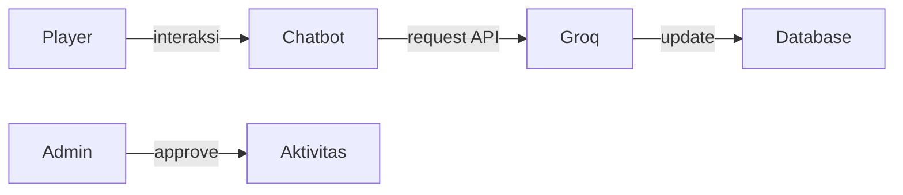
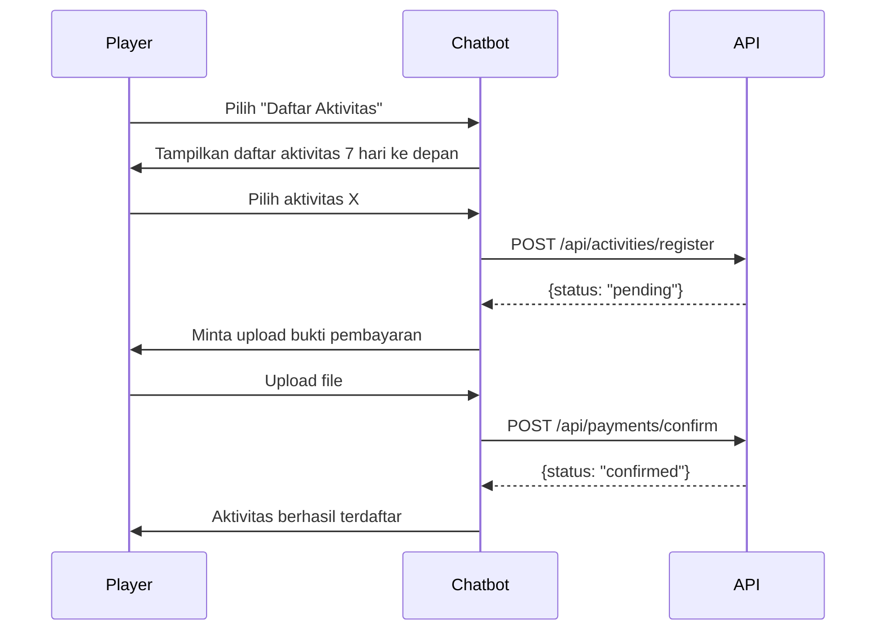
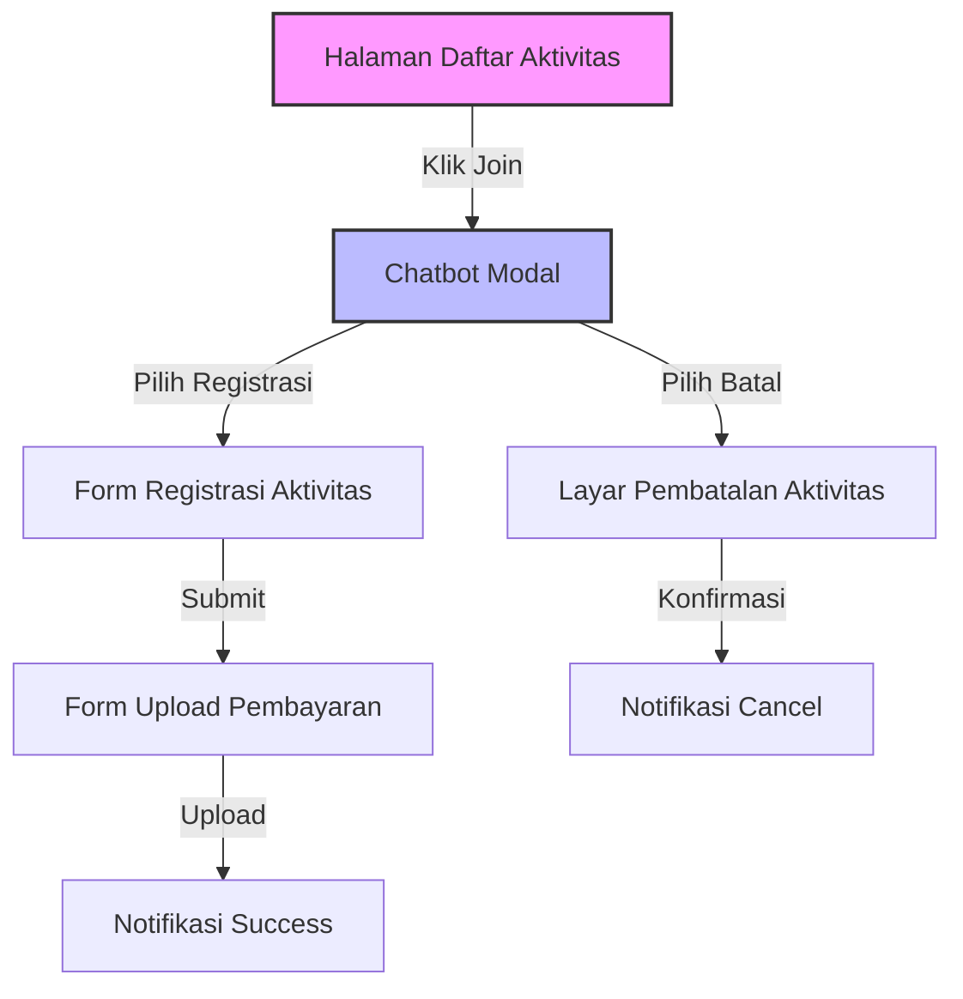
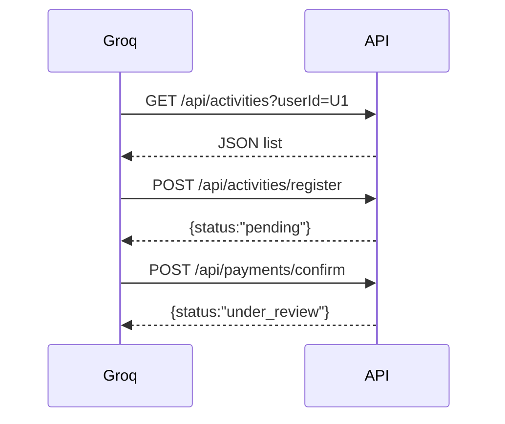
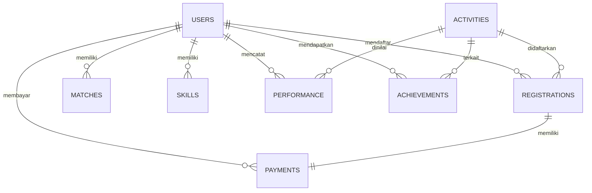

# Add Tools in Groq to read existing api

_Generated 2026-09-14T00:32:56.162Z_

## Product Idea

tambahkan kemampuan pada Groq untuk memanggil function di local untuk melakukan

- ambil activitas selama tujuh hari kedepan
- ambil hasil pertandingan berdasarkan user
- ambil skill yang di miliki berdasarkan user
- ambil performance yang di miliki user berdasarkan user dan activitas
- ambil achievments berdasarkan user
- rekomendasi activitas berdasarkan skill yang di butuhkan
- melakukan register aktifitas, melalui chatbot
- melakukan confirmasi pembayaran melalui chatbot
- melakukan pembataalan aktifitas

## Project Metadata

- **Status:** IN_PROGRESS
- **Platform:** WEB
- **Target users:** Tennis Player
- **Industry:** Tennis
- **Preferred tech:** NextJs, Groq

## Requirements

- [SCOPE · USER · 80%] Tambahkan kemampuan pada Groq untuk memanggil function lokal
- [SCOPE · USER · 80%] Ambil aktivitas selama tujuh hari ke depan
- [SCOPE · USER · 80%] Ambil hasil pertandingan berdasarkan user
- [SCOPE · USER · 80%] Ambil skill yang dimiliki berdasarkan user
- [SCOPE · USER · 80%] Ambil performance berdasarkan user dan aktivitas
- [SCOPE · USER · 80%] Ambil achievements berdasarkan user
- [SCOPE · USER · 80%] Rekomendasi aktivitas berdasarkan skill yang dibutuhkan
- [SCOPE · USER · 80%] Registrasi aktivitas melalui chatbot
- [SCOPE · USER · 80%] Konfirmasi pembayaran melalui chatbot
- [SCOPE · USER · 80%] Pembatalan aktivitas

## PRD (v3)

### Ringkasan Produk

# Ringkasan Produk

**Nama Produk:** Groq‑Chatbot Tennis (GCT)  
**Platform:** Web (Next.js)  
**Target Pengguna:** Pemain tenis amatir & admin  
**Tujuan Utama:** Menambahkan kemampuan pada Groq untuk memanggil fungsi lokal melalui REST API sehingga chatbot dapat:
- Menampilkan aktivitas tenis 7 hari ke depan
- Menarik hasil pertandingan, skill, performance, dan achievements pengguna
- Memberikan rekomendasi aktivitas berdasarkan skill yang dibutuhkan
- Memfasilitasi registrasi aktivitas, konfirmasi pembayaran, dan pembatalan aktivitas secara end‑to‑end melalui percakapan chatbot

## Konteks Aplikasi

- Aplikasi berbasis **Next.js** menampilkan halaman utama, daftar aktivitas, dan riwayat pengguna.  
- **Groq** berperan sebagai engine AI yang memproses query natural language dan memanggil fungsi lokal via **REST API**.  
- **Chatbot** di‑embed pada halaman web dan berinteraksi dengan pengguna menggunakan elemen UI: menu pilihan, form input, tombol konfirmasi, dan notifikasi.

## Diagram Arsitektur Sistem

```mermaid
flowchart LR
    subgraph Frontend[Next.js Frontend]
        UI[UI Web & Chatbot]
    end
    subgraph GroqEngine[Groq Engine]
        G[Groq Query Processor]
    end
    subgraph Backend[Backend Services]
        API[REST API (Function Layer)]
        DB[(Database)]
    end
    UI -->|User Input| G
    G -->|Call Function| API
    API -->|Read/Write| DB
    API -->|Response| G
    G -->|Reply| UI
```

## Alur Pengguna Inti (Ringkas)

1. Pengguna login ke aplikasi.  
2. Mengakses chatbot, meminta daftar aktivitas 7 hari ke depan.  
3. Memilih aktivitas → chatbot mengirim request `registerActivity`.  
4. Admin menyetujui, chatbot meminta bukti pembayaran.  
5. Pengguna mengunggah bukti → chatbot mengirim `confirmPayment`.  
6. Setelah konfirmasi, pengguna dapat membatalkan dalam 24 jam melalui chatbot.


### Tujuan Produk

# Tujuan Produk

## Tujuan Bisnis
- **Meningkatkan engagement** pemain amatir sebesar 30 % dalam 6 bulan dengan menyediakan proses pendaftaran dan pembayaran yang otomatis melalui chatbot.
- **Mengurangi beban admin** sebesar 40 % melalui otomatisasi persetujuan aktivitas dan verifikasi pembayaran.
- **Meningkatkan retensi** dengan rekomendasi aktivitas yang dipersonalisasi berdasarkan skill dan performance pengguna.

## Tujuan Teknis
- Mengimplementasikan **panggilan fungsi lokal** pada Groq via **REST API** dengan otentikasi **API Key**.
- Menyimpan semua entitas (aktivitas, pertandingan, skill, performance, achievements) dalam **skema database terstruktur**.
- Menyediakan **endpoint API** yang dapat di‑scale secara horizontal dan memiliki SLA **≥ 99,5 %**.
- Menjamin **respons time** chatbot ≤ 2 detik untuk setiap interaksi.
- Memastikan **keamanan data** dengan enkripsi TLS 1.2+ dan kontrol akses berbasis peran (Player vs Admin).

## Tujuan Pengalaman Pengguna (UX)
- Proses registrasi aktivitas → pembayaran → konfirmasi dapat diselesaikan **maksimal 3 langkah** dalam chatbot.
- Menampilkan **notifikasi real‑time** untuk status persetujuan, pembayaran, dan pembatalan.
- Memungkinkan **pembatalan aktivitas** hingga 24 jam setelah konfirmasi pembayaran tanpa penalti.


### Bukan Tujuan

# Bukan Tujuan

- **Dukungan pemain profesional**: Produk ini hanya melayani pemain tenis amatir; fitur khusus untuk turnamen profesional, ranking ATP/WTA, atau sponsor tidak termasuk.
- **Integrasi gateway pembayaran lain**: Hanya gateway pembayaran yang sudah terintegrasi (misalnya Midtrans) yang akan didukung; penambahan gateway baru berada di luar ruang lingkup.
- **Fitur video streaming atau analisis video**: Analisis berbasis video pertandingan tidak termasuk.
- **Pengelolaan klub atau fasilitas**: Manajemen lapangan, pemesanan fasilitas klub, atau sistem keanggotaan klub tidak termasuk.
- **Pengembangan aplikasi mobile native**: Fokus pada aplikasi web berbasis Next.js; aplikasi iOS/Android native akan dipertimbangkan pada fase selanjutnya.
- **Automasi pemasaran (email/SMS blast)**: Pengiriman notifikasi melalui email atau SMS tidak termasuk dalam fase awal.


### Pengguna Sasaran

# Pengguna Sasaran

- **Pemain Tenis Amatir**
  - Menggunakan aplikasi untuk menemukan, mendaftar, dan membayar aktivitas latihan atau turnamen.
  - Mengakses laporan skill, performance, dan achievements melalui chatbot.
- **Admin Sistem**
  - Mengelola persetujuan aktivitas, verifikasi pembayaran, dan mengatur rekomendasi.
  - Memiliki akses ke dashboard monitoring dan laporan statistik.

### Peran Pengguna

# Peran Pengguna

| Peran | Deskripsi | Hak Akses |
|---|---|---|
| Player | Pemain tenis amatir yang berinteraksi dengan chatbot untuk registrasi, pembayaran, dan melihat data pribadi. | Membaca & menulis data aktivitas, skill, performance, achievements; mengirimkan pembayaran; membatalkan aktivitas dalam 24 jam. |
| Admin | Pengelola aplikasi yang memverifikasi aktivitas dan pembayaran, serta mengatur rekomendasi. | Membaca semua data; menyetujui/menolak aktivitas; mengonfirmasi pembayaran; mengubah aturan bisnis. |
| System (Groq) | Mesin query yang memanggil fungsi lokal via REST API. | Membaca data melalui endpoint API; menulis log eksekusi; tidak memiliki hak modifikasi data langsung. |



### Fitur Utama

# Fitur Utama

1. **Pemanggilan Fungsi Lokal via Groq (REST API)**
   - Groq dapat mengeksekusi endpoint `/api/activities`, `/api/matches`, `/api/skills`, dll., menggunakan API Key.
2. **Chatbot Registrasi Aktivitas**
   - Dialog bertahap: pilih aktivitas → masukkan tanggal & waktu → konfirmasi.
3. **Konfirmasi Pembayaran melalui Chatbot**
   - Upload bukti pembayaran, verifikasi oleh admin, notifikasi status.
4. **Pembatalan Aktivitas**
   - Pengguna dapat membatalkan dalam 24 jam setelah konfirmasi pembayaran; sistem otomatis mengembalikan status.
5. **Rekomendasi Aktivitas Berdasarkan Skill**
   - Algoritma rekomendasi menilai skill (accuracy, power, konsistensi) dan menyarankan latihan yang relevan.
6. **Laporan Statistik Personal**
   - Chatbot menampilkan ringkasan hasil pertandingan, skill, performance, dan achievements.
7. **Manajemen Achievements**
   - Sistem menyimpan achievements dengan skema lengkap dan menampilkan badge di profil.
8. **Dashboard Admin**
   - Persetujuan aktivitas, verifikasi pembayaran, dan kontrol rekomendasi.

**Contoh Alur Chatbot (Mermaid)**


### Cerita Pengguna

## Cerita Pengguna

**Story 1: Registrasi Aktivitas via Chatbot**
- Sebagai pemain amatir
- Saya ingin mendaftar aktivitas tenis melalui chatbot
- Sehingga saya dapat bergabung tanpa meninggalkan halaman

**Given/When/Then**
```
Given pemain sudah login
When pemain memilih "Daftar Aktivitas" dan mengisi nama, tanggal, lokasi, jenis latihan, durasi
Then chatbot menyimpan data aktivitas, mengirim notifikasi ke admin, dan menampilkan status "Menunggu Persetujuan"
```

**Story 2: Konfirmasi Pembayaran**
- Sebagai pemain
- Saya ingin mengunggah bukti pembayaran melalui chatbot
- Sehingga admin dapat memverifikasi dan mengaktifkan keanggotaan aktivitas

**Given/When/Then**
```
Given aktivitas sudah disetujui admin
When pemain mengunggah bukti pembayaran
Then sistem menyimpan bukti, mengubah status menjadi "Pembayaran Dikirim", dan mengirim notifikasi ke admin
```

**Story 3: Pembatalan Aktivitas**
- Sebagai pemain
- Saya ingin membatalkan aktivitas dalam 24 jam setelah konfirmasi pembayaran
- Sehingga saya dapat mendapatkan refund

**Given/When/Then**
```
Given status pembayaran "Dikonfirmasi" dan waktu < 24 jam
When pemain memilih "Batalkan Aktivitas"
Then status berubah menjadi "Dibatalkan", refund diproses, dan notifikasi dikirim ke admin
```

### Kebutuhan Fungsional

## Kebutuhan Fungsional

### 1. Integrasi Groq ↔ REST API
- Groq memanggil endpoint `/api/local/{function}` dengan metode POST.
- Header `Authorization: ApiKey {key}` wajib.
- Payload JSON berisi `userId` dan parameter spesifik fungsi.

### 2. Endpoint API
| Endpoint | Metode | Deskripsi | Parameter |
|---|---|---|---|
| `/api/activities/next7days` | GET | Ambil aktivitas 7 hari ke depan untuk user | `userId` (query) |
| `/api/matches` | GET | Ambil hasil pertandingan user | `userId` (query) |
| `/api/skills` | GET | Ambil skill user | `userId` (query) |
| `/api/performance` | GET | Ambil performance berdasarkan user & activity | `userId`, `activityId` (query) |
| `/api/achievements` | GET | Ambil achievements user | `userId` (query) |
| `/api/recommendations` | GET | Rekomendasi aktivitas berdasarkan skill | `userId` (query) |
| `/api/activities/register` | POST | Registrasi aktivitas via chatbot | JSON body: `userId`, `name`, `date`, `time`, `location`, `type`, `duration` |
| `/api/payments/confirm` | POST | Konfirmasi pembayaran | JSON body: `userId`, `activityId`, `paymentProofUrl` |
| `/api/activities/cancel` | POST | Batalkan aktivitas | JSON body: `userId`, `activityId` |

### 3. Chatbot UI Flow
- Menu pilihan → Form input → Tombol konfirmasi → Notifikasi.
- Semua interaksi mengirim request ke endpoint di atas dan menampilkan respons.

### 4. Penyimpanan Data
- Tabel `activities` (id, user_id, name, date, time, location, type, duration, status).
- Tabel `matches` (id, user_id, opponent_id, score, date, is_double, partner_id).
- Tabel `skills` (id, user_id, skill_name, accuracy, power, consistency, updated_at).
- Tabel `performance` (id, user_id, activity_id, skill_name, target, mistakes, recorded_at).
- Tabel `achievements` (achievement_id, user_id, achievement_code, name, description, earned_at, points, related_activity_id, metadata).

### 5. Admin Approval Workflow
1. Admin melihat daftar aktivitas dengan status `Pending`.
2. Admin mengubah status menjadi `Approved` atau `Rejected`.
3. Notifikasi otomatis dikirim ke pemain via chatbot.

### Kebutuhan Non‑Fungsional

## Kebutuhan Non‑Fungsional

- **Keamanan**: Semua endpoint dilindungi API Key; wajib menggunakan HTTPS.
- **Kinerja**: Respons API ≤ 300 ms untuk panggilan Groq; UI chatbot ≤ 1 s per langkah.
- **Ketersediaan**: SLA 99,5 % uptime untuk layanan Groq dan API.
- **Skalabilitas**: Mendukung 10.000 concurrent users; gunakan serverless atau auto‑scale containers.
- **Observabilitas**: Logging terpusat, metrik latency, error rate, dan tracing untuk setiap request Groq → API.
- **Kepatuhan**: Data pribadi pemain sesuai GDPR/PDPA; enkripsi at‑rest.
- **Backup & Recovery**: Backup harian, RPO ≤ 4 jam.
- **Internationalization**: UI chatbot mendukung Bahasa Indonesia dan English.
- **Usability**: Proses registrasi & pembayaran selesai dalam ≤ 3 langkah.
- **Maintainability**: Kode API mengikuti ESLint, unit test coverage ≥ 80 %.

### Aturan Bisnis

## Aturan Bisnis

- **Batas Pembatalan**: Pengguna dapat membatalkan aktivitas **maksimal 24 jam** setelah status pembayaran berubah menjadi *Confirmed*. Pembatalan setelah batas waktu akan ditolak dan dana tidak dapat dikembalikan.
- **Persetujuan Aktivitas**: Semua permintaan pendaftaran aktivitas harus disetujui oleh **Admin** sebelum chatbot menampilkan opsi pembayaran.
- **Konfirmasi Pembayaran**: Setelah pengguna mengunggah bukti pembayaran, Admin harus meninjau dan mengubah status menjadi *Confirmed* dalam waktu **12 jam**. Jika tidak ada aksi, status otomatis menjadi *Expired*.
- **Validasi Data**:
  - Tanggal & waktu aktivitas tidak boleh berada di masa lalu.
  - Durasi aktivitas minimum **30 menit** dan maksimum **4 jam**.
  - Lokasi harus terdaftar dalam master data *Venue*.
- **Keamanan API**: Semua panggilan REST antara Groq dan fungsi lokal wajib menyertakan **API Key** yang terdaftar di sistem. API Key tidak boleh diekspos ke client.
- **Hak Akses**:
  - **Player**: dapat melihat, mendaftar, membatalkan (sesuai batas), dan mengunggah bukti pembayaran.
  - **Admin**: dapat menyetujui/menolak pendaftaran, memverifikasi pembayaran, mengubah status aktivitas, dan mengelola data master (Venue, Skill, dll).
  - **System (Groq)**: hanya dapat memanggil endpoint yang telah di‑whitelist dan tidak memiliki kemampuan menulis data secara langsung.
- **Rekomendasi Aktivitas**: Sistem hanya menyarankan aktivitas yang **memenuhi gap skill** pengguna dan tersedia dalam rentang 7 hari ke depan.
- **Audit Trail**: Setiap perubahan status (pendaftaran, persetujuan, pembayaran, pembatalan) harus dicatat dengan timestamp, user_id, dan aksi yang dilakukan.


### Alur Pengguna

```mermaid
flowchart TD
    A[Login] --> B[Dashboard]
    B --> C{Pilih Aktivitas}
    C -->|Klik "Join"| D[Chatbot: Mulai Registrasi]
    D --> E[Input Nama Aktivitas & Detail]
    E --> F[Chatbot: Tampilkan Ringkasan & Minta Konfirmasi]
    F -->|Ya| G[Permintaan Persetujuan Admin (API)]
    G --> H{Admin Approve?}
    H -->|Approve| I[Chatbot: Minta Upload Bukti Pembayaran]
    I --> J[Upload Bukti]
    J --> K[Chatbot: Kirim ke Admin untuk Verifikasi]
    K --> L{Admin Verifikasi}
    L -->|Approve| M[Status Pembayaran = Confirmed]
    M --> N[Chatbot: Notifikasi Sukses & Detail Aktivitas]
    L -->|Reject| O[Chatbot: Notifikasi Gagal & Minta Upload Ulang]
    H -->|Reject| P[Chatbot: Notifikasi Penolakan Pendaftaran]
    N --> Q{Apakah Pengguna Membatalkan?}
    Q -->|Ya (≤24h)| R[Chatbot: Konfirmasi Pembatalan]
    R --> S[Update Status = Cancelled]
    Q -->|Tidak| T[Aktivitas Berjalan]
    style A fill:#f9f,stroke:#333,stroke-width:2px
    style M fill:#bbf,stroke:#333,stroke-width:2px
```

### Arsitektur Informasi

## Arsitektur Informasi

- Home
  - Dashboard
    - Ringkasan Aktivitas (7 hari ke depan)
    - Statistik Skill & Performance
    - Achievements
  - Aktivitas
    - Daftar Aktivitas Tersedia
    - Detail Aktivitas
      - Tombol **Join**
      - Informasi Tanggal, Lokasi, Durasi, Jenis Latihan
  - Chatbot (Floating Widget)
    - Menu Pilihan
      - Registrasi Aktivitas
      - Upload Bukti Pembayaran
      - Pembatalan Aktivitas
      - Rekomendasi Aktivitas
    - Form Input
    - Notifikasi
  - Hasil Pertandingan
    - Daftar Pertandingan
    - Detail Pertandingan (Skor, Partner, Tanggal)
  - Skill & Performance
    - Daftar Skill
    - Detail Performance per Aktivitas
  - Achievements
    - Daftar Achievements
    - Detail Achievement
  - Admin Panel (hanya untuk Admin)
    - Persetujuan Aktivitas
    - Verifikasi Pembayaran
    - Manajemen Venue & Skill Master
    - Audit Log

### Spesifikasi Layar

## Spesifikasi Layar

### 1. Halaman Daftar Aktivitas
- **URL**: `/activities`
- **Komponen Utama**:
  - Tabel daftar aktivitas (kolom: Tanggal & waktu, Lokasi, Jenis latihan, Durasi, Status)
  - Filter tanggal (7 hari ke depan)
  - Tombol **Join** pada tiap baris
  - Badge status (Pending, Approved, Paid, Cancelled)
- **Interaksi**:
  - Klik **Join** membuka **Chatbot Modal** dengan konteks aktivitas terpilih.

### 2. Chatbot Modal
- **Tipe**: Overlay full‑screen modal.
- **Elemen UI**:
  - Header dengan nama aktivitas terpilih.
  - Menu pilihan (Registrasi, Lihat Detail, Batal).
  - Area percakapan (bubble chat).
  - Form dinamis (input teks, upload file, tombol konfirmasi).
  - Notifikasi toast untuk success/error.
- **Alur**:
  - Registrasi → Upload bukti pembayaran → Konfirmasi admin → Notifikasi selesai.

### 3. Form Registrasi Aktivitas (di dalam chatbot)
| Field | Tipe | Validasi | Keterangan |
|-------|------|----------|------------|
| Nama Aktivitas | teks (readonly) | tidak kosong | Di‑isi otomatis dari konteks |
| Tanggal & Waktu | datetime picker | harus dalam 7 hari ke depan | |
| Lokasi | teks | tidak kosong | |
| Jenis Latihan | dropdown (Latihan teknik, Fisik, Turnamen) | dipilih | |
| Durasi (menit) | number | >0 | |
| Tombol **Submit** | aksi | | Kirim ke `/api/activities/register` |

### 4. Form Upload Pembayaran
| Field | Tipe | Validasi |
|-------|------|----------|
| Bukti Transfer | file (jpg/png/pdf) | max 5 MB |
| Nomor Referensi | teks | tidak kosong |
| Tombol **Upload** | aksi | kirim ke `/api/payments/confirm` |

### 5. Layar Konfirmasi & Notifikasi
- **Success Screen**: “Registrasi berhasil, tunggu persetujuan admin.” + tombol **Kembali ke Daftar**.
- **Error Screen**: Menampilkan pesan error spesifik + opsi **Ulangi**.

### 6. Layar Pembatalan Aktivitas
- Diakses lewat tombol **Batal** pada chatbot setelah status *Paid*.
- Menampilkan pesan konfirmasi “Apakah Anda yakin ingin membatalkan? Pembatalan dapat dilakukan dalam 24 jam.” + tombol **Ya, Batalkan**.

### 7. Dashboard Admin (opsional)
- Daftar semua permintaan registrasi dengan filter status.
- Tombol **Approve** / **Reject** dan **Verify Payment**.

#### Diagram Navigasi Layar


### 8. Responsivitas
- Semua layar harus responsif untuk desktop (≥1024 px) dan mobile (≥320 px).
- Chatbot modal menyesuaikan tinggi viewport, scroll internal bila konten melebihi tinggi.


### Kebutuhan API

## Kebutuhan API

Semua endpoint di‑expose sebagai **REST API** dan di‑akses oleh Groq melalui **API Key** pada header `x-api-key`.

| No | Metode | Endpoint | Deskripsi | Autentikasi | Parameter | Contoh Respons |
|----|--------|----------|-----------|-------------|-----------|----------------|
| 1 | GET | `/api/activities` | Ambil daftar aktivitas 7 hari ke depan untuk user | API Key | `userId` (query, wajib) `days=7` (default) | `[{ "activityId": "a1", "dateTime": "...", "location": "...", "type": "...", "duration": 90, "status": "Pending"}]` |
| 2 | GET | `/api/matches` | Ambil hasil pertandingan user | API Key | `userId` (query) | `[{ "matchId":"m1","date":"...","opponent":"John Doe","score":"6-3, 4-6, 7-5","type":"Singles"}]` |
| 3 | GET | `/api/skills` | Ambil skill user | API Key | `userId` (query) | `[{ "skill":"Forehand","accuracy":85,"power":78,"consistency":80}]` |
| 4 | GET | `/api/performance` | Ambil performance berdasarkan user & aktivitas | API Key | `userId` (query), `activityId` (query) | `[{ "performanceId":"p1","skill":"Serve","target":"80% first serve","errors":2}]` |
| 5 | GET | `/api/achievements` | Ambil achievements user | API Key | `userId` (query) | `[{ "achievementId":"ach1","code":"WIN_5_MATCHES","name":"5 Wins","earnedAt":"2024-08-01","points":50}]` |
| 6 | POST | `/api/recommendations` | Dapatkan rekomendasi aktivitas berdasarkan skill yang dibutuhkan | API Key | Body: `{ "userId":"u1", "requiredSkills":["Serve","Footwork"] }` | `{ "recommendations":[ {"activityId":"a2","reason":"Meningkatkan Serve"} ] }` |
| 7 | POST | `/api/activities/register` | Registrasi aktivitas baru (dipanggil oleh Groq) | API Key | Body: `{ "userId":"u1","activityId":"a3","dateTime":"2024-09-20T10:00","location":"Club A","type":"Latihan Fisik","duration":60 }` | `{ "status":"pending","registrationId":"reg123" }` |
| 8 | POST | `/api/payments/confirm` | Konfirmasi pembayaran (upload bukti) | API Key | Form‑Data: `registrationId`, `paymentReference`, `file` | `{ "status":"under_review","paymentId":"pay456" }` |
| 9 | POST | `/api/activities/cancel` | Batalkan aktivitas (maks 24 jam setelah konfirmasi) | API Key | Body: `{ "registrationId":"reg123","reason":"Tidak dapat hadir" }` | `{ "status":"cancelled","cancelledAt":"2024-09-15T08:30" }` |

### Contoh Header Permintaan
```
x-api-key: YOUR_SECURE_API_KEY
Content-Type: application/json
```

### Aturan Umum
- **Rate Limit**: 100 request per menit per API Key.
- **Error Handling**: Semua error dikembalikan dengan struktur:
```json
{
  "error": {
    "code": "INVALID_PARAMETER",
    "message": "Parameter `userId` wajib."
  }
}
```
- **Timeout**: 5 detik untuk respons standar.

### Diagram Alur Panggilan API oleh Groq



### Model Data

## Model Data

Berikut skema basis data utama yang diperlukan. Semua tabel menggunakan **PostgreSQL** (atau kompatibel) dengan `uuid` sebagai primary key.

### 1. Tabel `users`
| Kolom | Tipe | Keterangan |
|------|------|------------|
| user_id | UUID PK | Identitas unik pemain |
| email | VARCHAR(255) | Unik, login |
| name | VARCHAR(100) |
| role | ENUM('player','admin') | Hak akses |
| created_at | TIMESTAMP | otomatis |
| updated_at | TIMESTAMP | otomatis |

### 2. Tabel `activities`
| Kolom | Tipe | Keterangan |
|------|------|------------|
| activity_id | UUID PK |
| date_time | TIMESTAMP |
| location | VARCHAR(200) |
| type | ENUM('Latihan Teknik','Latihan Fisik','Turnamen') |
| duration_minutes | INT |
| created_by | UUID FK → users.user_id |
| created_at | TIMESTAMP |
| updated_at | TIMESTAMP |

### 3. Tabel `registrations`
| Kolom | Tipe | Keterangan |
|------|------|------------|
| registration_id | UUID PK |
| user_id | UUID FK → users.user_id |
| activity_id | UUID FK → activities.activity_id |
| status | ENUM('pending','approved','paid','cancelled') |
| registered_at | TIMESTAMP |
| cancelled_at | TIMESTAMP NULL |
| cancel_reason | TEXT NULL |

### 4. Tabel `payments`
| Kolom | Tipe | Keterangan |
|------|------|------------|
| payment_id | UUID PK |
| registration_id | UUID FK → registrations.registration_id |
| reference_number | VARCHAR(50) |
| receipt_url | TEXT |
| status | ENUM('under_review','approved','rejected') |
| submitted_at | TIMESTAMP |
| reviewed_at | TIMESTAMP NULL |

### 5. Tabel `matches`
| Kolom | Tipe | Keterangan |
|------|------|------------|
| match_id | UUID PK |
| user_id | UUID FK → users.user_id |
| opponent | VARCHAR(100) |
| date | DATE |
| score | VARCHAR(50) |
| type | ENUM('Singles','Doubles') |
| partner | VARCHAR(100) NULL |
| created_at | TIMESTAMP |

### 6. Tabel `skills`
| Kolom | Tipe | Keterangan |
|------|------|------------|
| skill_id | UUID PK |
| user_id | UUID FK → users.user_id |
| skill_name | VARCHAR(50) |
| accuracy | INT | 0‑100 |
| power | INT | 0‑100 |
| consistency | INT | 0‑100 |
| recorded_at | TIMESTAMP |

### 7. Tabel `performance`
| Kolom | Tipe | Keterangan |
|------|------|------------|
| performance_id | UUID PK |
| user_id | UUID FK → users.user_id |
| activity_id | UUID FK → activities.activity_id |
| skill_name | VARCHAR(50) |
| target | TEXT |
| errors | INT |
| recorded_at | TIMESTAMP |

### 8. Tabel `achievements`
| Kolom | Tipe | Keterangan |
|------|------|------------|
| achievement_id | UUID PK |
| user_id | UUID FK → users.user_id |
| achievement_code | VARCHAR(30) |
| name | VARCHAR(100) |
| description | TEXT |
| earned_at | TIMESTAMP |
| points | INT |
| related_activity_id | UUID FK → activities.activity_id NULL |
| metadata | JSONB |

### ER Diagram


### Aturan Integritas
- **Foreign Key**: `ON DELETE CASCADE` untuk `registrations` → `payments` agar pembayaran terhapus bila registrasi dihapus.
- **Unique Constraint**: `users.email` unik; `achievements (user_id, achievement_code)` unik per pengguna.
- **Check Constraint**: `skills.accuracy`, `skills.power`, `skills.consistency` antara 0‑100.
- **Trigger**: Setelah `payments.status = 'approved'` otomatis ubah `registrations.status` menjadi `paid`.


### Analitik

## Analitik

### Metrik Utama
- **Aktivitas Terdaftar (7 hari ke depan)**: jumlah aktivitas yang berhasil didaftarkan melalui chatbot.
- **Rasio Konversi Pembayaran**: persentase aktivitas yang berlanjut ke pembayaran berhasil.
- **Waktu Penyelesaian Chatbot**: rata-rata durasi (detik) dari permulaan interaksi hingga konfirmasi pembayaran atau pembatalan.
- **Net Promoter Score (NPS) Chatbot**: skor kepuasan pengguna setelah interaksi selesai.
- **Tingkat Pembatalan**: persentase pembatalan dalam 24 jam setelah konfirmasi pembayaran.
- **Rekomendasi yang Diterima**: jumlah rekomendasi aktivitas yang dipilih pengguna.
- **Penggunaan Fungsi Groq**: jumlah pemanggilan fungsi lokal per hari.

### Dashboard Contoh
| Metrik | Hari Ini | 7 Hari | 30 Hari |
|--------|----------|--------|---------|
| Aktivitas Terdaftar | 45 | 312 | 1 254 |
| Rasio Konversi | 78 % | 74 % | 71 % |
| Rata‑rata Durasi (detik) | 42 | 48 | 55 |
| NPS Chatbot | 62 | 58 | 55 |
| Tingkat Pembatalan | 5 % | 6 % | 7 % |

### Alur Pengumpulan Data (Mermaid)
```mermaid
flowchart TD
    A[Pengguna] -->|Interaksi Chatbot| B[Chatbot UI]
    B -->|Panggil API| C[REST API (fungsi lokal)]
    C -->|Simpan/Update| D[Database]
    D -->|Emit Event| E[Event Bus]
    E -->|Kirim ke| F[Analytics Service]
    F -->|Update Dashboard| G[Dashboard UI]
```

### Event Tracking
- `activity.registered` – payload: `{activityId, userId, timestamp}`
- `payment.initiated` – payload: `{paymentId, activityId, amount, timestamp}`
- `payment.confirmed` – payload: `{paymentId, status, timestamp}`
- `activity.cancelled` – payload: `{activityId, userId, reason, timestamp}`
- `recommendation.shown` – payload: `{userId, skillIds, recommendations, timestamp}`
- `groq.function.called` – payload: `{functionName, parameters, duration, timestamp}`

### Kriteria Penerimaan

## Kriteria Penerimaan

### 1. Pemanggilan Fungsi Lokal via Groq
- **Given** Groq memiliki definisi fungsi `getUpcomingActivities` dengan API Key yang valid  
- **When** chatbot meminta aktivitas 7 hari ke depan untuk user X  
- **Then** sistem mengembalikan daftar minimal 0 aktivitas dengan struktur JSON yang sesuai dalam ≤ 500 ms  

### 2. Registrasi Aktivitas melalui Chatbot
- **Given** pengguna telah login dan memilih aktivitas “Latihan Servis”  
- **When** pengguna mengirimkan perintah “Daftar” pada chatbot  
- **Then** chatbot menampilkan formulir input (tanggal, waktu, lokasi, durasi) dan menyimpan data ke tabel `activities` dengan status `pending`  

### 3. Konfirmasi Pembayaran
- **Given** ada aktivitas dengan status `pending` dan pengguna mengunggah bukti pembayaran  
- **When** admin menyetujui bukti melalui panel admin  
- **Then** status aktivitas berubah menjadi `confirmed` dan pengguna menerima notifikasi “Pembayaran berhasil” dalam 2 menit  

### 4. Pembatalan Aktivitas
- **Given** aktivitas berstatus `confirmed` dan belum melewati batas 24 jam sejak konfirmasi  
- **When** pengguna mengirimkan perintah “Batalkan” pada chatbot  
- **Then** sistem mengubah status menjadi `cancelled`, mengembalikan dana secara otomatis, dan mengirimkan notifikasi pembatalan  

### 5. Rekomendasi Aktivitas Berdasarkan Skill
- **Given** pengguna memiliki skill `accuracy` = 80 % dan `power` = 70 %  
- **When** pengguna meminta rekomendasi melalui chatbot  
- **Then** sistem mengembalikan minimal 3 aktivitas yang menargetkan peningkatan skill dengan confidence ≥ 80 %  

### 6. Keamanan API
- **Given** sebuah request REST ke endpoint `/api/skill/get` tanpa API Key atau dengan key tidak valid  
- **When** request diproses oleh gateway  
- **Then** response berstatus `401 Unauthorized` dan tidak mengungkapkan data apapun  

### 7. Ketersediaan Layanan
- **Given** beban trafik 500 req/menit pada endpoint Groq  
- **When** layanan dijalankan selama 1 jam  
- **Then** uptime tercatat ≥ 99,5 % dan latency rata‑rata ≤ 400 ms  

*Semua skenario di atas harus lolos pengujian otomatis (unit, integration, end‑to‑end) dan mendapat persetujuan QA sebelum release.*

### Tugas Pengembangan

## Tugas Pengembangan

### 1. Persiapan Infrastruktur
- Buat repository monorepo `tennis-app` (Next.js + API).
- Konfigurasi CI/CD pipeline (GitHub Actions) untuk linting, testing, dan deploy ke Vercel.
- Siapkan environment variables: `API_KEY_GROQ`, `PAYMENT_GATEWAY_SECRET`, dsb.

### 2. Desain & Implementasi API REST
| No | Endpoint | Metode | Deskripsi | Owner |
|----|----------|--------|-----------|-------|
| 2.1 | `/api/activities/upcoming` | GET | Mengembalikan aktivitas 7 hari ke depan untuk user | Backend |
| 2.2 | `/api/activities/register` | POST | Menyimpan registrasi aktivitas baru | Backend |
| 2.3 | `/api/payments/confirm` | POST | Menerima bukti pembayaran dan mengubah status | Backend |
| 2.4 | `/api/activities/cancel` | POST | Membatalkan aktivitas dalam batas 24 jam | Backend |
| 2.5 | `/api/recommendations` | GET | Menghasilkan rekomendasi berdasarkan skill | Backend |
| 2.6 | `/api/skill/get` | GET | Mengambil skill pengguna | Backend |
| 2.7 | `/api/performance/get` | GET | Mengambil performance berdasarkan user & aktivitas | Backend |
| 2.8 | `/api/achievements/get` | GET | Mengambil achievements pengguna | Backend |

- Implementasi masing‑masing endpoint dengan validasi schema (Zod) dan otentikasi API Key.
- Tambahkan logging terstruktur (Winston) dan error handling standar.

### 3. Integrasi Groq
- Definisikan fungsi Groq (`getUpcomingActivities`, `getMatchResults`, `getUserSkills`, `getUserPerformance`, `getUserAchievements`, `getRecommendations`).
- Buat adaptor serverless (`/api/groq/handler`) yang menerima panggilan Groq, memanggil endpoint REST internal, dan mengembalikan hasil.
- Tambahkan middleware verifikasi API Key untuk setiap panggilan Groq.

### 4. Pengembangan Chatbot UI (Next.js)
- Buat komponen `ChatbotWidget` dengan state machine (XState) untuk mengelola alur:
  1. Pilihan menu
  2. Form input registrasi
  3. Upload bukti pembayaran
  4. Konfirmasi / pembatalan
- Integrasikan komponen dengan endpoint API melalui `fetch` yang menyertakan header `x-api-key`.
- Implementasikan notifikasi toast (react-hot-toast) untuk feedback real‑time.

### 5. Keamanan & Compliance
- Implementasi API Key rotation script.
- Enkripsi data sensitif (bukti pembayaran) di storage menggunakan AES‑256.
- Penambahan CSP, XSS protection, dan rate limiting (express-rate-limit).

### 6. Pengujian
- Unit test untuk setiap handler (Jest + supertest).
- Integration test untuk alur lengkap chatbot (Cypress).
- Load test pada endpoint Groq dengan k6 (target 500 req/menit).
- Security test: verify 401 pada request tanpa API Key.

### 7. Dokumentasi
- Swagger/OpenAPI spec untuk semua endpoint.
- Panduan integrasi Groq (README di `/docs/groq-integration.md`).
- User guide untuk admin (cara menyetujui pembayaran, membatalkan aktivitas).

### 8. Deploy & Monitoring
- Deploy API ke Vercel Serverless Functions.
- Setup monitoring dengan Datadog: latency, error rate, API Key usage.
- Konfigurasi alert pada threshold latency > 400 ms atau error rate > 1 %.

### 9. Release & Post‑Release
- Release candidate ke staging, lakukan UAT dengan 5 pemain amatir.
- Kumpulkan feedback, perbaiki bug kritis.
- Tag versi `v1.0.0` dan push ke production.

*Setiap tugas harus memiliki definisi “Definition of Done” yang mencakup kode review, tes coverage ≥ 80 %, dan dokumentasi yang up‑to‑date.*

## User Flow

Alur Pengguna

```mermaid
flowchart TD
    A[Login] --> B[Dashboard]
    B --> C{Pilih Aktivitas}
    C -->|Klik "Join"| D[Chatbot: Mulai Registrasi]
    D --> E[Input Nama Aktivitas & Detail]
    E --> F[Chatbot: Tampilkan Ringkasan & Minta Konfirmasi]
    F -->|Ya| G[Permintaan Persetujuan Admin (API)]
    G --> H{Admin Approve?}
    H -->|Approve| I[Chatbot: Minta Upload Bukti Pembayaran]
    I --> J[Upload Bukti]
    J --> K[Chatbot: Kirim ke Admin untuk Verifikasi]
    K --> L{Admin Verifikasi}
    L -->|Approve| M[Status Pembayaran = Confirmed]
    M --> N[Chatbot: Notifikasi Sukses & Detail Aktivitas]
    L -->|Reject| O[Chatbot: Notifikasi Gagal & Minta Upload Ulang]
    H -->|Reject| P[Chatbot: Notifikasi Penolakan Pendaftaran]
    N --> Q{Apakah Pengguna Membatalkan?}
    Q -->|Ya (≤24h)| R[Chatbot: Konfirmasi Pembatalan]
    R --> S[Update Status = Cancelled]
    Q -->|Tidak| T[Aktivitas Berjalan]
    style A fill:#f9f,stroke:#333,stroke-width:2px
    style M fill:#bbf,stroke:#333,stroke-width:2px
```
