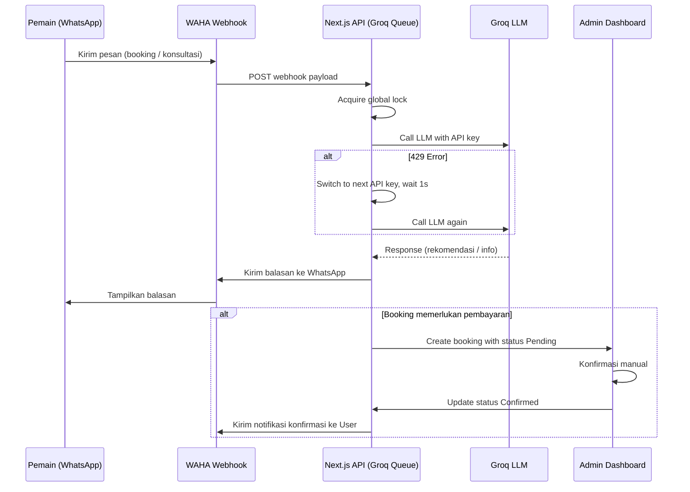
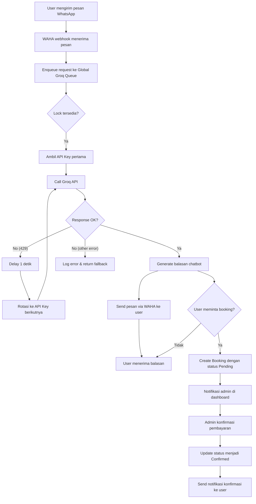
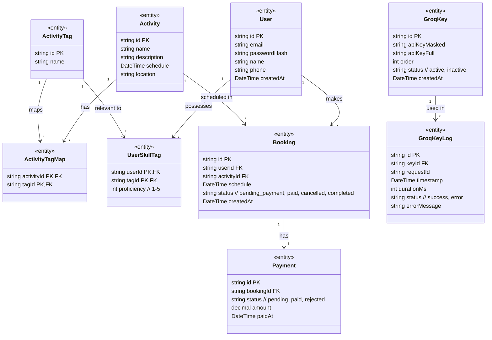
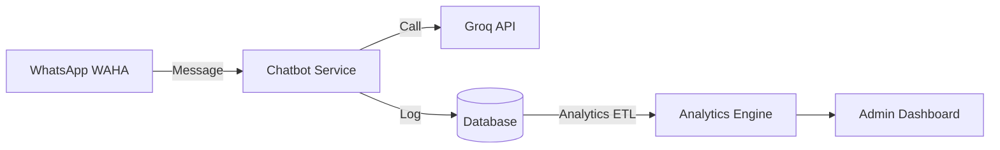

# Chat bot mengguanakan WAHA pada existing tennis community

_Generated 2026-09-12T23:10:13.141Z_

## Product Idea

saya ingin membuat sebuah chat bot yang membantu user tenis untuk melakukan sebuah booking, konsultasi training apa yang harus di lakukan untuk improve kemampuan nya, atau harus ikut fun match untuk melatih mental berdasarkan data yang ada pada aplikasi.

tambahkan fitur untuk memberitahukan kemampuan apa yang akan terlatih pada activity yang sudah ada, sehingga chat bot dapat merekomendasikan activity (training, fun match) yang tepat untuk user.

user juga dapat menanyakan progress latihan nya, skill yang di miliki hingga booking training atau fun match,
untuk booking jika ternyata ada payment maka akan ada konfirmasi manual oleh admin dari app untuk pembayaran, dan user akan menerima balasan, 

semua chat bot akan dilakukan di WhatsApp menggunakan trhird party WAHA
untuk mengirim pesan di WA, menggunakan WAHA, dan untuk mengloah pertanyaan dan tanya jawab akan menggunakan Groq, 

dalam admin tambahakan settingan untuk setting api key groq lebih dari satu, untuk menjadi cadangan ketika mendapatkan 429 dari api groq , makan akan pindah ke API key yang lain hingga berhasil, jika semua masih gagal maka kirim lakukan delay 1 menit. dan untuk chat bot ini buat antrian untuk call api ke Groq, sehingga dalam satu waktu hanya satu sesi user yang bakal di jawab. untuk meminimalisir error 429

## Project Metadata

- **Status:** IN_PROGRESS
- **Platform:** WEB
- **Target users:** Tennis Playar
- **Industry:** Community
- **Preferred tech:** NextJs, WAHA, Groq

## Requirements

- [SCOPE · USER · 80%] Membuat chatbot di WhatsApp menggunakan WAHA untuk membantu pengguna tenis melakukan booking, konsultasi training, atau fun match.
- [SCOPE · USER · 80%] Chatbot harus dapat merekomendasikan activity (training atau fun match) yang tepat berdasarkan data kemampuan yang akan terlatih.
- [SCOPE · USER · 80%] Pengguna dapat menanyakan progress latihan, skill yang dimiliki, dan melakukan booking training atau fun match.
- [SCOPE · USER · 80%] Jika booking memerlukan pembayaran, admin harus melakukan konfirmasi manual dan pengguna menerima balasan.
- [SCOPE · USER · 80%] Mengirim pesan di WhatsApp menggunakan WAHA, dan memproses pertanyaan serta tanya jawab menggunakan layanan Groq.
- [SCOPE · USER · 80%] Menambahkan pengaturan di admin untuk memasukkan lebih dari satu API key Groq sebagai cadangan ketika terjadi error 429.
- [SCOPE · USER · 80%] Jika semua API key gagal, sistem harus menunda permintaan selama 1 menit sebelum mencoba kembali.
- [SCOPE · USER · 80%] Membuat antrian pemanggilan API Groq sehingga hanya satu sesi pengguna yang diproses sekaligus untuk mengurangi risiko 429.
- [SCOPE · USER · 80%] Platform target berupa web (kemungkinan untuk dashboard admin).
- [SCOPE · USER · 80%] Teknologi yang diinginkan: Next.js, WAHA, Groq.

## PRD (v4)

### Product Overview

# Product Overview

Chatbot WhatsApp **Tennis Assistant** membantu pemain tenis melakukan:

- Booking training atau fun‑match
- Konsultasi peningkatan skill berdasarkan data historis
- Menanyakan progress latihan dan skill yang dimiliki
- Mendapatkan rekomendasi activity (training / fun‑match) yang tepat dengan tag kemampuan

### Teknologi Utama
- **WAHA** – webhook untuk mengirim & menerima pesan WhatsApp secara real‑time.  
- **Groq** – LLM yang memproses pertanyaan, mencari activity berbasis tag, dan menghasilkan rekomendasi.  
- **Next.js** – Dashboard admin, API route dengan lock (queue) untuk pemanggilan Groq, serta manajemen API‑key.  
- **Database** – Menyimpan profil pemain, riwayat latihan, katalog activity, booking & log Groq.

### Arsitektur Ringkas
```mermaid
flowchart TD
    WA[WhatsApp (WAHA)] -->|Webhook| API[Next.js API Route]
    API -->|Query| DB[(Database)]
    API -->|Call| Groq[Groq LLM]
    Groq -->|Result| API
    API -->|Response| WA
    Admin[Admin Dashboard] -->|Manajemen API‑key & Konfirmasi Pembayaran| API
```

### Dashboard Admin
- Manajemen API‑key Groq (tambah/hapus, urutan rotasi)  
- Log detail tiap pemanggilan Groq (waktu, key, status)  
- Daftar booking, status pembayaran, dan konfirmasi manual  

---

### Goals

# Goals

1. **Meningkatkan efisiensi booking**  
   - Pengguna dapat melakukan booking hanya dengan percakapan WhatsApp, tanpa harus membuka aplikasi lain.
2. **Memberikan rekomendasi training yang relevan**  
   - Sistem menyarankan activity yang paling cocok berdasarkan tag kemampuan (mis. forehand, mobility) dan histori latihan.
3. **Mengurangi error 429 pada pemanggilan Groq**  
   - Implementasi antrian global satu sesi pada satu waktu, rotasi API‑key otomatis, dan retry 1 x per key.
4. **Menyederhanakan proses konfirmasi pembayaran**  
   - Admin dapat mengonfirmasi pembayaran secara manual melalui dashboard; pengguna menerima notifikasi status *pending* atau *confirmed*.
5. **Menyediakan visibilitas penuh bagi admin**  
   - Log lengkap setiap panggilan Groq (waktu, key yang dipakai, response) serta tampilan status booking dan pembayaran.
6. **Keamanan & kepatuhan data**  
   - Autentikasi email & password, enkripsi data sensitif, dan penyimpanan minimal data pribadi sesuai regulasi.

### Non-Goals

# Non‑Goals

- Pengembangan aplikasi mobile native (iOS / Android).
- Integrasi gateway pembayaran baru selain yang sudah ada di aplikasi existing.
- Fitur video‑call atau live‑stream training melalui WhatsApp.
- Analitik lanjutan berbasis AI di luar rekomendasi activity (mis. prediksi cedera).
- Dukungan bahasa selain Bahasa Indonesia.
- Otomatisasi konfirmasi pembayaran (semua konfirmasi tetap manual).

### Target Users

## Target Users

**1. Pemain Tenis (Player)**
- Usia: 12‑45 tahun
- Tingkat kemampuan: pemula, menengah, lanjutan
- Kebutuhan utama: 
  - Memesan sesi training atau fun‑match secara cepat melalui WhatsApp
  - Mendapatkan rekomendasi activity yang sesuai dengan kemampuan dan tujuan latihan
  - Melihat progres latihan, skill yang dimiliki, serta riwayat booking
  - Mendapatkan notifikasi status pembayaran (pending, confirmed)

**2. Admin Utama**
- Peran: mengelola seluruh operasi chatbot, konfirmasi pembayaran, dan mengatur API key Groq
- Kebutuhan utama:
  - Dashboard web untuk menambah/menhapus API key Groq secara urut
  - Melihat log detail setiap pemanggilan API Groq (waktu, key yang dipakai, status response)
  - Konfirmasi manual pembayaran dan mengirimkan balasan ke pengguna
  - Mengawasi antrian global pemanggilan Groq untuk menghindari error 429

**3. Admin (hanya admin)**
- Peran: membantu admin utama dalam tugas operasional harian, misalnya memeriksa booking yang pending, menandai pembayaran, atau meninjau log Groq.
- Kebutuhan utama: akses read‑only ke log Groq, kemampuan mengubah status pembayaran, dan melihat statistik penggunaan chatbot.


### User Roles

## User Roles

| Role | Description | Permissions |
|------|-------------|-------------|
| **Player** | Pengguna akhir yang berinteraksi dengan chatbot melalui WhatsApp. | - Mengirim pertanyaan, booking, dan permintaan rekomendasi activity.<br>- Melihat progres latihan di dashboard pribadi.<br>- Menerima notifikasi status pembayaran. |
| **Admin Utama** | Pengelola utama sistem backend dan dashboard admin. | - Menambah/menhapus API key Groq (urutan prioritas).<br>- Melihat dan mengekspor log pemanggilan Groq (waktu, key, status).<br>- Mengkonfirmasi pembayaran secara manual dan mengirimkan balasan ke pemain.<br>- Mengatur antrian global Groq (lock). |
| **Admin** | Staf pendukung yang membantu admin utama. | - Membaca log Groq.<br>- Mengubah status pembayaran (pending → confirmed).<br>- Mengakses laporan booking dan statistik penggunaan. |

**Permission Matrix**

```text
User Roles
├─ Player
│   ├─ Send/Receive WhatsApp messages
│   ├─ View personal progress
│   └─ Receive payment notifications
├─ Admin Utama
│   ├─ Manage Groq API keys
│   ├─ View detailed Groq logs
│   ├─ Confirm payments manually
│   └─ Control global Groq queue lock
└─ Admin
    ├─ Read Groq logs
    ├─ Update payment status
    └─ View booking & analytics reports
```


### Features

## Features

### 1. Chatbot WhatsApp (WAHA Integration)
- **Webhook WAHA** menerima semua pesan masuk secara real‑time.
- Bot dapat melakukan **booking training / fun‑match**, **konsultasi rekomendasi activity**, dan **cek progres**.
- Semua percakapan diproses oleh LLM Groq melalui antrian tunggal.

### 2. Rekomendasi Activity Berbasis Tag
- Setiap activity memiliki **tag kemampuan** (misal: `forehand`, `mobility`, `backhand`).
- Bot melakukan pencarian semantik pada database activity dan mengembalikan **semua rekomendasi yang cocok**.
- Contoh tag:
  - `Jumat Sore` → `forehand`, `mobility`, `backhand`
  - `Kamis Malam` → `forehand`

### 3. Antrian Global API Groq (Next.js API Route Lock)
- Hanya satu sesi pengguna yang diproses pada satu waktu.
- Jika terjadi **error 429**, sistem otomatis:
  1. Menggunakan API key berikutnya (retry **1 kali** per key).
  2. Menunggu **1 detik** sebelum panggilan berikutnya.
  3. Jika semua key gagal, menunda **1 menit** sebelum retry kembali.
- Tidak ada notifikasi ke admin pada error 429.

### 4. Manajemen API Key Groq (Admin Dashboard)
- Halaman **Tambah / Hapus API Key** dengan urutan prioritas.
- Sistem otomatis **loop** melalui key yang ada saat memanggil Groq.
- Log detail setiap pemanggilan Groq (waktu, key yang dipakai, status response) dapat dilihat dan diekspor.

### 5. Konfirmasi Pembayaran Manual
- Saat booking memerlukan pembayaran, status otomatis menjadi **Pending**.
- Admin membuka detail booking, menandai **Confirmed** (tanpa harus memasukkan nomor referensi).
- Bot mengirimkan balasan konfirmasi ke pengguna melalui WAHA.

### 6. User Dashboard (Web)
- Sudah ada; menampilkan progres latihan, riwayat booking, dan kemampuan yang dimiliki.

### 7. Analytics & Reporting
- Statistik jumlah booking, konversi pembayaran, frekuensi error 429, dan penggunaan rekomendasi activity.

---

#### Flow: Chatbot Interaction


---

#### Acceptance Criteria (Given/When/Then)

**Feature 1 – Chatbot Responsiveness**
- **Given** ada pesan masuk melalui WAHA,
- **When** bot memproses pesan dengan Groq (tanpa error 429),
- **Then** balasan harus dikirim ke pengguna dalam ≤ 2 detik.

**Feature 2 – API Key Rotation**
- **Given** API key #1 menghasilkan error 429,
- **When** sistem otomatis beralih ke API key #2 dan menunggu 1 detik,
- **Then** panggilan berhasil atau, bila semua key gagal, sistem menunda 1 menit sebelum retry.

**Feature 3 – Manual Payment Confirmation**
- **Given** sebuah booking dengan status *Pending*,
- **When** admin menekan tombol *Confirm* pada dashboard,
- **Then** status berubah menjadi *Confirmed* dan pengguna menerima notifikasi konfirmasi via WhatsApp.

**Feature 4 – Activity Recommendation**
- **Given** pengguna meminta rekomendasi activity untuk tanggal tertentu,
- **When** LLM mencari activity dengan tag yang cocok,
- **Then** bot mengirimkan **semua** activity yang memiliki setidaknya satu tag yang cocok dengan kebutuhan pengguna.

**Feature 5 – Groq Call Log Visibility**
- **Given** admin membuka halaman *Groq Log*,
- **When** ada panggilan API Groq yang selesai,
- **Then** log menampilkan timestamp, API key yang dipakai, dan status (success / 429 / error).


### User Stories

## User Stories

### Player (Pengguna Tenis)

1. **Booking Training**
   - *Sebagai* pemain tenis, *saya ingin* memesan sesi training melalui WhatsApp, *sehingga* saya dapat meningkatkan skill pada hari dan waktu yang saya pilih.
2. **Booking Fun Match**
   - *Sebagai* pemain tenis, *saya ingin* memesan fun match untuk melatih mental dan taktik, *sehingga* saya dapat berlatih dalam situasi pertandingan.
3. **Konsultasi Rekomendasi Activity**
   - *Sebagai* pemain tenis, *saya ingin* menanyakan aktivitas yang paling cocok berdasarkan kemampuan saya, *sehingga* saya mendapatkan rekomendasi yang relevan.
4. **Cek Progress Latihan**
   - *Sebagai* pemain tenis, *saya ingin* melihat ringkasan progress latihan dan skill yang sudah dikuasai, *sehingga* saya dapat memantau perkembangan diri.
5. **Pembayaran & Status**
   - *Sebagai* pemain tenis, *saya ingin* mengetahui status pembayaran ("pending"/"confirmed") setelah melakukan booking, *sehingga* saya tahu apakah sesi sudah terkonfirmasi.
6. **Ubah / Batalkan Booking**
   - *Sebagai* pemain tenis, *saya ingin* mengubah atau membatalkan booking yang sudah dibuat, *sehingga* saya dapat menyesuaikan jadwal (fitur sudah ada di aplikasi existing).

### Admin (Admin Utama)

1. **Manajemen API Key Groq**
   - *Sebagai* admin, *saya ingin* menambah, menghapus, dan mengurutkan API key Groq, *sehingga* sistem dapat beralih otomatis saat terjadi error 429.
2. **Konfirmasi Pembayaran Manual**
   - *Sebagai* admin, *saya ingin* melihat booking yang membutuhkan konfirmasi pembayaran, menandai sebagai "confirmed" atau "pending", *sehingga* pengguna menerima notifikasi yang tepat.
3. **Monitoring Log Groq**
   - *Sebagai* admin, *saya ingin* melihat log detail setiap pemanggilan API Groq (waktu, key yang dipakai, status), *sehingga* dapat melakukan audit dan troubleshooting.
4. **Laporan & Analitik**
   - *Sebagai* admin, *saya ingin* melihat statistik booking, konversi, dan frekuensi error 429, *sehingga* dapat mengoptimalkan operasional.

### Functional Requirements

## Functional Requirements

### 1. WhatsApp Integration (WAHA)
- **Webhook Endpoint**: Next.js API route `/api/whatsapp/webhook` menerima POST dari WAHA.
- **Message Types**: Text, quick‑reply, dan template messages.
- **Security**: Verifikasi signature WAHA menggunakan secret token.

### 2. Message Processing Pipeline
1. **Receive Message** → 2. **Enqueue Groq Call** → 3. **Generate Response** → 4. **Send via WAHA**.
```mermaid
flowchart TD
    A[Incoming WA Message] --> B[Validate & Store]
    B --> C[Enqueue Groq Request]
    C --> D[Groq Processor (Lock)]
    D --> E[Generate Bot Reply]
    E --> F[Send Reply via WAHA]
    F --> G[Log Interaction]
```

### 3. Groq API Queue (Global Lock)
- Implemented using a **single mutex** in a Next.js API route (`/api/groq/query`).
- Only one request can invoke Groq at a time; others wait in FIFO queue.
- Timeout per request: 30 seconds.

### 4. API Key Rotation & Retry Logic
| Step | Action |
|------|--------|
| 1 | Use first API key from ordered list. |
| 2 | If response **429**, switch to next key immediately. |
| 3 | Retry **once** per key (total 1 attempt per key). |
| 4 | Wait **1 detik** between retries. |
| 5 | If all keys fail, delay **1 menit** before re‑trying the whole cycle. |
| 6 | No admin notification on 429 (as per rule). |

### 5. Activity Recommendation Engine
- **Data Source**: `Activity` table dengan tag (misalnya `forehand`, `mobility`).
- **User Profile**: Tag kemampuan yang belum dikuasai disimpan pada profil pengguna.
- **Logic**: Semantic search via Groq atas deskripsi activity + tag; mengembalikan **semua** activity yang cocok.
- **Output**: Daftar activity dengan tanggal, waktu, dan tag yang akan dilatih.

### 6. Booking Workflow
1. User memilih activity (training / fun match) lewat chat.
2. Sistem membuat record `Booking` dengan status **pending**.
3. Jika activity memerlukan pembayaran:
   - Status tetap **pending**.
   - Admin menerima notifikasi di dashboard.
   - Admin menandai sebagai **confirmed** setelah verifikasi manual.
   - Sistem mengirimkan pesan konfirmasi ke user.
4. Jika tidak memerlukan pembayaran, status langsung **confirmed** dan user menerima konfirmasi.

### 7. Progress & Skill Query
- User mengirim kata kunci seperti “progress” atau “skill”.
- Bot mengambil data terbaru dari `TrainingLog` dan mengagregasi level skill per tag.
- Respons mencakup:
  - Total sesi selesai.
  - Rating skill per tag.
  - Rekomendasi activity selanjutnya.

### 8. Admin Dashboard (Web)
- **API Key Management**: Halaman untuk tambah / hapus / urutkan Groq keys.
- **Payment Confirmation**: Daftar booking pending dengan tombol *Confirm* untuk mengubah status.
- **Groq Call Log**: Tabel menampilkan timestamp, key yang dipakai, payload, status response, dan durasi.
- **Analytics Overview**: Jumlah booking, conversion rate, frekuensi error 429.

### 9. Logging & Auditing
- Semua pesan masuk/keluar WhatsApp disimpan di `MessageLog`.
- Setiap panggilan Groq disimpan di `GroqKeyLog`.
- Semua aksi admin tercatat di `AdminAuditLog`.

### 10. Authentication & Authorization
- Dashboard dilindungi dengan email & password (JWT session).
- Role‑based access: hanya **Admin Utama** yang dapat mengelola API key dan mengonfirmasi pembayaran.

### Non-Functional Requirements

## Non‑Functional Requirements

| Category | Requirement | Acceptance |
|----------|-------------|------------|
| **Performance** | Respons time chatbot ≤ 2 detik setelah Groq menghasilkan jawaban. | Load test 100 concurrent messages, 95 % ≤ 2 detik. |
| **Scalability** | Queue Groq bersifat global tetapi dapat di‑scale horizontal dengan Redis lock jika beban > 200 req/menit. | Dokumentasi fallback ke Redis. |
| **Reliability** | Sistem harus tersedia 99,5 % per bulan. | Monitoring uptime via health‑check endpoint. |
| **Error Handling** | 429 error ditangani otomatis sesuai rotasi key; jika semua gagal, delay 1 menit sebelum retry. | Unit test meniru 429 pada semua key. |
| **Security** | Data pribadi (nama, nomor WA) dienkripsi at rest (AES‑256). | Penetration test OWASP Top 10. |
| **Compliance** | Mematuhi GDPR/PDPA untuk data pengguna Indonesia. | Dokumentasi consent dan hak penghapusan data. |
| **Maintainability** | Kode terstruktur dengan TypeScript, linting, dan unit test coverage ≥ 80 %. | CI pipeline gagal bila coverage < 80 %. |
| **Observability** | Log terpusat (Elastic/Logstash) dengan label `service:whatsapp-bot`. | Dashboard Kibana menampilkan error rate < 0.5 %. |
| **Backup & Recovery** | Database backup harian, retensi 30 hari. | DR test berhasil restore dalam ≤ 30 menit. |
| **Usability** | Dashboard admin harus dapat menambah API key dalam ≤ 3 klik. | Usability test dengan 5 admin, rata‑rata waktu < 30 detik. |

### Business Rules

## Business Rules

### 1. Pembayaran
- **Status Pending**: Jika booking memerlukan pembayaran, status otomatis menjadi **Pending** sampai admin melakukan konfirmasi manual.
- **Konfirmasi Manual**: Admin mengubah status menjadi **Confirmed** setelah memverifikasi pembayaran (tidak perlu memasukkan nomor referensi atau bukti transaksi).
- **Notifikasi User**: Setelah konfirmasi, sistem mengirimkan pesan WhatsApp kepada user bahwa pembayaran telah diterima.

### 2. Rotasi API Key Groq
- **Jumlah Percobaan per Key**: 1 kali per API key.
- **Delay antar Percobaan**: 1 detik sebelum mencoba key berikutnya.
- **Fallback**: Jika semua key gagal (error 429), sistem menunda seluruh proses selama **1 menit** lalu memulai kembali dari key pertama.
- **Tidak ada Notifikasi ke Admin** pada kegagalan 429.

### 3. Antrian Global Groq
- **Lock Global**: Hanya satu sesi user yang dapat memanggil API Groq pada satu waktu (menggunakan lock pada Next.js API route).
- **Queue FIFO**: Permintaan masuk akan diproses secara First‑In‑First‑Out.

### 4. Rekomendasi Activity
- **Tag‑Based Matching**: Setiap activity memiliki satu atau lebih tag (misal: `forehand`, `mobility`, `backhand`). Sistem mencari semua activity yang memiliki setidaknya satu tag yang cocok dengan tag kemampuan user.
- **Multiple Recommendations**: Jika lebih dari satu activity cocok, semua activity tersebut dikirimkan ke user sebagai pilihan.

### 5. Manajemen API Key (Admin)
- **Tambah/Hapus Key**: Admin dapat menambah atau menghapus API key pada halaman **API Keys**.
- **Urutan Prioritas**: Key diproses sesuai urutan yang ditentukan di UI (drag‑and‑drop atau urutan numerik).
- **Log Penggunaan**: Setiap pemanggilan API Groq dicatat dalam **Groq Logs** (waktu, key yang dipakai, status response).

### 6. Booking Workflow
- **Booking → Pending Payment** → **Admin Confirmation** → **Confirmed** → **WhatsApp Confirmation**.
- **Pembatalan/Perubahan**: Dikelola oleh existing aplikasi, tidak mempengaruhi aturan di sini.

### 7. Keamanan & Akses
- **Akses Admin**: Hanya pengguna dengan peran **Admin utama** atau **Admin** yang dapat mengakses dashboard admin.
- **Autentikasi**: Email & password dengan hash bcrypt dan token JWT.

### 8. Logging & Monitoring
- **Groq Call Log**: Menyimpan `timestamp`, `apiKeyId`, `statusCode`, `responseTime`.
- **Error 429 Counter**: Metrik untuk memantau frekuensi error 429 per key.

---

**Acceptance Criteria (Given/When/Then)**

- **Given** ada tiga API key yang terdaftar, **When** satu key mengembalikan error 429, **Then** sistem otomatis beralih ke key berikutnya setelah menunggu 1 detik.
- **Given** semua key mengembalikan error 429, **When** percobaan selesai, **Then** sistem menunda 1 menit sebelum mencoba kembali.
- **Given** booking memerlukan pembayaran, **When** admin menekan tombol **Confirm**, **Then** status booking berubah menjadi *Confirmed* dan user menerima notifikasi WhatsApp.
- **Given** user meminta rekomendasi activity, **When** LLM menemukan dua activity yang cocok, **Then** bot mengirimkan kedua activity tersebut beserta tag yang dilatih.


### User Flow

## User Flow



### Penjelasan Flow
1. **Inbound Message** – WAHA menerima pesan dan memanggil webhook Next.js.
2. **Queue & Lock** – Permintaan dimasukkan ke antrian global; hanya satu request yang dapat mengeksekusi Groq pada satu waktu.
3. **API Key Rotation** – Sistem mencoba API key pertama; jika 429, menunggu 1 detik, lalu mencoba key berikutnya.
4. **Response Handling** – Jika berhasil, LLM menghasilkan teks balasan; jika gagal setelah semua key, sistem menunda 1 menit sebelum retry.
5. **Booking Path** – Bila user meminta booking, dibuat entri dengan status *Pending*; admin melakukan konfirmasi manual, kemudian sistem mengirimkan notifikasi ke user.

---

**Acceptance Criteria (Given/When/Then)**

- **Given** user mengirim pesan “Saya ingin booking training Jumat sore”, **When** webhook dipanggil, **Then** sistem menambahkan request ke queue, memanggil Groq, dan mengirimkan pilihan activity yang cocok.
- **Given** semua API key mengembalikan 429, **When** percobaan selesai, **Then** sistem menunda 1 menit sebelum mencoba lagi.
- **Given** booking dibuat dengan status *Pending*, **When** admin menekan **Confirm**, **Then** status berubah menjadi *Confirmed* dan user menerima pesan konfirmasi.


### Information Architecture

## Information Architecture

```
Admin Dashboard
├─ Dashboard Overview
├─ Users
│   ├─ List Users
│   └─ User Detail
├─ Activities
│   ├─ List Activities
│   ├─ Create / Edit Activity
│   └─ Tags Management
├─ Bookings
│   ├─ Pending
│   ├─ Confirmed
│   └─ Cancelled / History
├─ Payments
│   ├─ Pending Payments
│   └─ Payment History
├─ Groq API Keys
│   ├─ List Keys (order priority)
│   ├─ Add New Key
│   └─ Delete / Reorder Key
├─ Groq Logs
│   ├─ Log List
│   │   ├─ Timestamp
│   │   ├─ API Key ID
│   │   ├─ Status Code
│   │   └─ Response Time
│   └─ Export CSV
├─ Reports & Analytics
│   ├─ Booking Metrics
│   ├─ Activity Recommendation Usage
│   └─ 429 Error Frequency
└─ Settings
    ├─ Authentication (Email & Password)
    └─ System Preferences

User Dashboard (Player)
├─ Profile
│   ├─ Personal Info
│   └─ Skill Tags
├─ Progress
│   ├─ Training History
│   └─ Skill Development Chart
├─ Recommendations
│   └─ List of Recommended Activities (with tags)
├─ Bookings
│   ├─ Upcoming
│   └─ Past & Cancelled
└─ Support
    └─ Chat with Bot (WhatsApp link)
```

### Navigasi Utama
- **Top Bar**: Logo, Notifikasi (admin), User Avatar → Logout.
- **Side Menu** (admin): *Dashboard, Users, Activities, Bookings, Payments, Groq API Keys, Groq Logs, Reports, Settings*.
- **Side Menu** (player): *Profile, Progress, Recommendations, Bookings, Support*.

---

**Acceptance Criteria (Given/When/Then)**

- **Given** admin login berhasil, **When** ia mengakses menu **Groq API Keys**, **Then** ia melihat tabel dengan urutan key, tombol *Add*, *Delete*, dan drag‑and‑drop untuk mengubah prioritas.
- **Given** admin berada di halaman **Groq Logs**, **When** ia memfilter berdasarkan tanggal, **Then** sistem menampilkan log dengan kolom *Timestamp, API Key ID, Status Code, Response Time*.
- **Given** player membuka **Recommendations**, **When** LLM menghasilkan dua activity yang cocok, **Then** halaman menampilkan kedua activity beserta tag yang akan dilatih.


### Screen Specifications

## Screen Specifications

### Admin Dashboard

#### 1. Manajemen API Key Groq
- **URL:** `/admin/groq-keys`
- **Tipe:** Halaman tabel
- **Elemen UI**
  - Tabel menampilkan: `Key ID`, `API Key (masked)`, `Status (aktif/non-aktif)`, `Urutan`.
  - Tombol **Tambah Key** → modal dengan input `API Key`.
  - Tombol **Hapus** pada tiap baris.
  - Drag‑and‑drop atau tombol **Naik/Turun** untuk mengatur urutan prioritas.
- **Aksi**
  - Simpan key → panggil endpoint `POST /api/admin/groq-keys`.
  - Hapus key → `DELETE /api/admin/groq-keys/:id`.
  - Ubah urutan → `PUT /api/admin/groq-keys/order`.

#### 2. Log Pemanggilan Groq
- **URL:** `/admin/groq-logs`
- **Tabel kolom:** `Timestamp`, `Key ID`, `Request ID`, `Durasi (ms)`, `Status (success/error)`, `Pesan error`.
- **Filter:** tanggal, status, key.
- **Export CSV**.

#### 3. Konfirmasi Pembayaran Manual
- **URL:** `/admin/payments`
- **Daftar booking dengan status `pending_payment`**.
- **Kolom:** `Booking ID`, `User`, `Activity`, `Jumlah`, `Waktu Booking`, `Status`.
- **Aksi:** tombol **Konfirmasi** → ubah status menjadi `paid` dan kirim notifikasi WA ke user.
- **Aksi tambahan:** tombol **Tolak** → ubah status menjadi `rejected` dan kirim notifikasi.

#### 4. Manajemen Booking
- **URL:** `/admin/bookings`
- **Fungsi:** lihat, filter, ubah status (cancel, reschedule).
- **Kolom:** `Booking ID`, `User`, `Activity`, `Tanggal & Waktu`, `Status`, `Pembayaran`.

### User Dashboard (sudah ada)
- Ringkas: menampilkan progress skill, riwayat booking, tombol **Booking Baru** yang mengarahkan ke flow WA.

#### Acceptance Criteria (Given/When/Then)
- **Given** admin berada di halaman *Manajemen API Key*,
  **When** menambah key baru dan menekan *Simpan*,
  **Then** key tersimpan, muncul di tabel, dan urutan prioritas terupdate.

- **Given** ada booking dengan status `pending_payment`,
  **When** admin menekan *Konfirmasi*,
  **Then** status berubah menjadi `paid`, WAHA mengirim pesan konfirmasi ke user, dan log tercatat.

- **Given** admin membuka *Log Groq*,
  **When** memilih filter `error` pada tanggal tertentu,
  **Then** tabel menampilkan semua panggilan yang gagal beserta key yang dipakai.

### API Requirements

## API Requirements

### 1. WAHA Webhook
- **Endpoint:** `POST /api/webhook/waha`
- **Auth:** Token WAHA di header `X-WAHA-Signature` (verifikasi HMAC).
- **Payload:** standar WAHA message JSON.
- **Process:** enqueue pesan ke **Groq Queue** (global lock) → jawab via WAHA.

### 2. Groq Proxy (Next.js API Route)
- **Endpoint:** `POST /api/groq/query`
- **Auth:** JWT admin/user (depends konteks).
- **Request Body:** `{ "prompt": "string", "sessionId": "string" }`
- **Response:** `{ "answer": "string", "usage": {...} }`
- **Logic:**
  1. Acquire global lock (`groqLock`) – only satu request aktif.
  2. Pilih API key pertama yang status **aktif**.
  3. Call Groq dengan timeout 10 s.
  4. Jika response 429 → log, pindah ke key berikutnya, retry **1** kali per key.
  5. Jika semua key gagal → tunggu 60 s, kemudian retry seluruh siklus.
  6. Release lock, return answer atau error.

### 3. Manajemen API Key Groq
| Method | Path | Auth | Request | Response |
|--------|------|------|---------|----------|
| GET | `/api/admin/groq-keys` | JWT admin | - | `[{id, maskedKey, status, order}]` |
| POST | `/api/admin/groq-keys` | JWT admin | `{ "apiKey": "string" }` | `{ "id": "...", "status":"active" }` |
| DELETE | `/api/admin/groq-keys/:id` | JWT admin | - | `{ "deleted": true }` |
| PUT | `/api/admin/groq-keys/order` | JWT admin | `{ "order": ["id1","id2",...] }` | `{ "updated": true }` |

### 4. Log Groq
- **GET** `/api/admin/groq-logs` – query param `status`, `keyId`, `from`, `to`.
- Response: array log objects `{ timestamp, keyId, requestId, durationMs, status, errorMessage }`.

### 5. Booking & Payment
- **POST** `/api/bookings` – buat booking (user). Body `{ "activityId": "...", "scheduleId": "..." }`.
- **GET** `/api/bookings/:id` – detail.
- **PATCH** `/api/bookings/:id/status` – admin ubah status (`paid`, `rejected`, `canceled`).
- **POST** `/api/payments/confirm` – admin konfirmasi, body `{ "bookingId": "..." }`.

### 6. Activity & Tag Lookup
- **GET** `/api/activities?tags=forehand,mobility` – mengembalikan list activity yang memiliki semua tag.
- **Response**: `{ "activities": [{"id","name","schedule","tags"}] }`.

### Non‑functional
- Rate limit: maksimum 5 request per detik ke endpoint `/api/groq/query` (lock already enforces).
- Logging semua request dengan requestId UUID.
- Semua endpoint harus mengembalikan kode HTTP standar (200, 400, 401, 429, 500).

#### Acceptance Criteria
- **Given** WAHA mengirim pesan masuk,
  **When** webhook `/api/webhook/waha` menerima payload yang valid,
  **Then** pesan masuk masuk antrian Groq dan user menerima balasan dalam ≤2 detik setelah Groq merespon.

- **Given** semua API key Groq menghasilkan 429,
  **When** sistem telah mencoba tiap key satu kali,
  **Then** sistem menunggu 60 detik sebelum mencoba kembali dan mencatat delay di log.

### Data Model

## Data Model



### Table Summary (TBD for additional fields)

#### Acceptance Criteria
- **Given** ada activity dengan tag `forehand` dan `mobility`,
  **When** user meminta rekomendasi dengan skill tag yang sama,
  **Then** query ke `/api/activities?tags=forehand,mobility` mengembalikan activity tersebut.

- **Given** admin menonaktifkan sebuah GroqKey,
  **When** key tersebut dihapus atau status diubah menjadi `inactive`,
  **Then** sistem tidak akan menggunakannya dalam rotasi selanjutnya.

### Analytics

## Analytics

### 1. Booking Metrics
- **Total bookings per week** – jumlah booking yang berhasil dibuat setiap minggu.
- **Booking conversion rate** – persentase permintaan booking yang berakhir menjadi booking terkonfirmasi.
- **Pending payment ratio** – persentase booking yang statusnya *pending* karena belum dikonfirmasi admin.

### 2. Chatbot Interaction
- **Messages processed per day** – total pesan masuk yang diproses oleh chatbot.
- **Average response time** – waktu rata‑rata (ms) dari penerimaan pesan hingga balasan dikirim.
- **429 error count** – jumlah respons *429 Too Many Requests* yang diterima dari Groq per hari.

### 3. Recommendation Effectiveness
- **Recommendations shown** – berapa kali activity direkomendasikan ke user.
- **Acceptance rate** – persentase rekomendasi yang diikuti user (booking setelah rekomendasi).
- **Skill improvement correlation** – (opsional) perubahan skor kemampuan pengguna berdasarkan aktivitas yang dipilih.

### 4. Admin Activity
- **API key usage log count** – berapa kali masing‑masing API key Groq dipanggil.
- **Manual payment confirmations** – jumlah konfirmasi pembayaran yang dilakukan admin.
- **Average admin handling time** – waktu rata‑rata yang dibutuhkan admin untuk menandai pembayaran sebagai *confirmed*.

### 5. System Health
- **API queue length** – panjang antrian pemanggilan Groq pada saat tertentu.
- **Groq call success rate** – persentase panggilan Groq yang berhasil (tidak 429 atau error lain).
- **Uptime** – persentase waktu sistem tersedia (target ≥ 99.5%).

### 6. Dashboard Visualisation
- Grafik garis untuk tren booking mingguan.
- Heatmap response time per jam.
- Tabel log API key dengan kolom: timestamp, key ID, status, latency.




### Acceptance Criteria

## Acceptance Criteria

### A. Chatbot Basic Interaction
- **Given** pengguna mengirim pesan ke nomor WhatsApp yang terhubung WAHA
- **When** webhook WAHA menerima payload dan meneruskan ke Next.js API route
- **Then** chatbot harus membalas dalam ≤ 2 detik dengan teks yang relevan (booking, rekomendasi, atau progress).

### B. Rekomendasi Activity
- **Given** pengguna meminta rekomendasi training atau fun match
- **When** LLM Groq dipanggil dengan data profil kemampuan dan tag activity
- **Then** sistem mengembalikan minimal satu activity yang memiliki tag yang cocok dengan kemampuan pengguna.
- **And** semua activity yang cocok ditampilkan (tidak ada filter prioritas kecuali user meminta spesifik).

### C. Booking dengan Payment Pending
- **Given** pengguna memilih activity yang memerlukan pembayaran
- **When** booking disimpan dengan status *pending*
- **Then** admin menerima notifikasi di dashboard admin.
- **And** setelah admin menandai *confirmed*, pengguna menerima pesan konfirmasi pembayaran.

### D. Manual Payment Confirmation
- **Given** sebuah booking berstatus *pending*
- **When** admin menekan tombol **Confirm Payment** pada halaman booking detail
- **Then** status booking berubah menjadi *confirmed* dan pesan WhatsApp dikirim ke pengguna.
- **And** tidak diperlukan nomor referensi atau bukti transaksi tambahan.

### E. API Key Management
- **Given** admin berada pada halaman **API Key Management**
- **When** admin menambah, mengedit, atau menghapus Groq API key
- **Then** perubahan langsung tersimpan dan urutan key digunakan untuk rotasi otomatis.
- **And** UI menampilkan list key dengan status *active* atau *inactive*.

### F. Groq Call Queue & 429 Handling
- **Given** ada lebih dari satu permintaan ke Groq secara bersamaan
- **When** antrian global (Next.js API route lock) mengizinkan hanya satu sesi aktif
- **Then** permintaan berikutnya menunggu hingga sesi sebelumnya selesai.
- **And** jika respons 429 diterima, sistem:
  1. Menggunakan API key berikutnya (retry 1 kali per key).
  2. Menunggu 1 detik sebelum mencoba key selanjutnya.
  3. Jika semua key gagal, menunggu 1 menit sebelum mengulang percobaan.
- **And** tidak ada notifikasi ke admin pada error 429.

### G. Log API Calls
- **Given** setiap panggilan ke Groq berhasil atau gagal
- **When** log disimpan di tabel `GroqKeyLog`
- **Then** admin dapat melihat detail log pada halaman **Groq Call Log** termasuk timestamp, key ID, status, latency.

### H. Security & Access Control
- **Given** seorang user mencoba mengakses dashboard admin
- **When** user tidak memiliki peran *Admin utama* atau *admin*
- **Then** akses ditolak dengan pesan *Forbidden*.

### I. Performance
- **Given** beban produksi normal (≤ 200 pesan per menit)
- **When** sistem beroperasi
- **Then** rata‑rata response time chatbot ≤ 2 detik dan antrian Groq tidak melebihi 5 permintaan menunggu.


### Development Tasks

## Development Tasks

### Phase 1 – Project Setup & Infrastructure
1. Initialize monorepo dengan **Next.js** (app router) dan **TypeScript**.
2. Configure ESLint, Prettier, dan CI pipeline (GitHub Actions).
3. Setup PostgreSQL (atau MySQL) database & Prisma schema.
4. Deploy staging environment on Vercel (or preferred cloud).

### Phase 2 – WAHA Integration
5. Register WhatsApp Business number on WAHA and obtain webhook URL.
6. Implement Next.js API route `/api/whatsapp/webhook` to receive WAHA POST payloads.
7. Verify signature/authentication of incoming webhook requests.
8. Create service layer `whatsappService` to send messages via WAHA REST API.

### Phase 3 – Core Chatbot Logic
9. Design message router that classifies intents (booking, recommendation, progress, etc.).
10. Implement Groq request wrapper with:
    - API‑key rotation logic (array of keys).
    - Global lock (mutex) using `nextjs-lock` or custom in‑memory semaphore.
    - 429 handling per business rules (retry 1× per key, 1 s delay, 1 min fallback).
11. Store each Groq call in `GroqKeyLog` (timestamp, keyId, status, latency).

### Phase 4 – Recommendation Engine
12. Define `ActivityTag` taxonomy (e.g., `forehand`, `mobility`, `backhand`).
13. Populate `Activity` table with sample data and associated tags.
14. Build LLM prompt template that injects user profile, tag list, and asks Groq for matching activities.
15. Return list of activities (no prioritization) to chatbot response formatter.

### Phase 5 – Booking & Payment Workflow
16. Create `Booking` model with fields: userId, activityId, schedule, status (pending/confirmed/cancelled), paymentRequired (bool).
17. Implement booking API `/api/booking/create` that:
    - Validates schedule availability.
    - Sets status *pending* when paymentRequired = true.
    - Triggers WhatsApp message to user confirming receipt.
18. Build admin endpoint `/api/booking/confirm` to mark payment as confirmed and send WhatsApp confirmation.

### Phase 6 – Admin Dashboard UI
19. Scaffold pages under `/admin` using Next.js App Router.
20. **API Key Management** page:
    - Form to add/edit/delete keys.
    - List view showing order, status, and usage count.
21. **Groq Call Log** page:
    - Table with pagination, sortable columns (timestamp, key, status, latency).
22. **Payment Confirmation** page:
    - Table of pending bookings with **Confirm** button.
23. Apply role‑based access control (RBAC) – only users with role `admin` or `admin utama` can access `/admin/*`.

### Phase 7 – User Dashboard (existing)
24. Verify existing user dashboard displays progress, skill tags, dan booking history.
25. Add endpoint `/api/user/progress` if needed for real‑time data.

### Phase 8 – Testing & Quality Assurance
26. Unit tests for:
    - WAHA webhook parser.
    - Groq wrapper (including rotation & 429 logic).
    - Booking service.
27. Integration tests simulating full WhatsApp conversation flow.
28. Load test the Groq queue (e.g., using k6) to ensure single‑session lock works under 200 msg/min.
29. Security tests: authentication, RBAC, injection protection.

### Phase 9 – Monitoring & Analytics
30. Instrument API routes with OpenTelemetry / Vercel analytics.
31. Set up Grafana dashboards for metrics defined in **Analytics** section.
32. Configure alerting on:
    - Groq 429 error rate > 5%.
    - Queue length > 10.
    - Booking pending > 24 jam.

### Phase 10 – Deployment & Release
33. Create production CI/CD pipeline with automated DB migrations.
34. Perform smoke test on production environment.
35. Publish documentation for admin users (API key setup, payment confirmation workflow).
36. Conduct hand‑over training for **Admin utama**.

---
*All tasks are estimated in story points; sprint planning will allocate them across 2‑week sprints.*

### Features

#### F-001 · Integrasi WAHA Webhook (P0)
Menerima pesan masuk dari WhatsApp via webhook WAHA dan mengirim balasan secara real‑time.

*User story:* Sebagai sistem, saya ingin menerima webhook WAHA sehingga dapat memproses pesan pengguna secara otomatis.

*Business rules:* Webhook harus diverifikasi dengan token rahasia; balasan dikirim dalam 5 detik.

#### F-002 · Inti Chatbot dengan Groq (P0)
Menganalisis intent pengguna (booking, konsultasi training, progress) menggunakan model LLM Groq dan menghasilkan respons teks.

*User story:* Sebagai pengguna, saya ingin mengirim pertanyaan ke WhatsApp dan mendapatkan jawaban yang relevan sehingga saya dapat merencanakan latihan.

*Business rules:* Setiap permintaan diproses satu per satu melalui antrian global; hanya satu sesi aktif pada satu waktu.

*Dependencies:* F-001

#### F-003 · Rekomendasi Activity Berdasarkan Tag (P0)
Menggunakan tag kemampuan (mis. forehand, mobility) dan riwayat latihan untuk menyarankan satu atau lebih activity yang cocok.

*User story:* Sebagai pemain tenis, saya ingin chatbot merekomendasikan training atau fun match yang akan melatih kemampuan saya sehingga saya dapat meningkatkan performa.

*Business rules:* Jika lebih dari satu activity cocok, semua ditampilkan; rekomendasi diambil dari pencarian semantik pada basis data activity.

*Dependencies:* F-002

#### F-004 · Proses Booking Activity (P0)
Menyimpan pilihan activity, tanggal, dan waktu ke dalam sistem serta menandai status booking sebagai "pending payment" bila diperlukan.

*User story:* Sebagai pengguna, saya ingin melakukan booking activity melalui chat sehingga saya dapat mengamankan slot latihan saya.

*Business rules:* Jika activity memerlukan pembayaran, status otomatis menjadi pending dan notifikasi dikirim ke admin.

*Dependencies:* F-002

#### F-005 · Konfirmasi Pembayaran Manual oleh Admin (P0)
Admin dapat membuka detail booking, menandai pembayaran selesai, dan mengirimkan konfirmasi ke pengguna melalui WhatsApp.

*User story:* Sebagai admin, saya ingin mengonfirmasi pembayaran secara manual sehingga pengguna mendapatkan status booking yang terupdate.

*Business rules:* Setelah konfirmasi, status berubah menjadi "confirmed" dan bot mengirimkan pesan notifikasi ke user.

*Dependencies:* F-004

#### F-006 · Manajemen API Key Groq di Dashboard Admin (P1)
Halaman untuk menambah, menghapus, dan mengurutkan beberapa API key Groq sebagai cadangan.

*User story:* Sebagai admin, saya ingin mengelola API key Groq sehingga sistem dapat beralih otomatis saat satu key terkena limit.

*Business rules:* Key disimpan dalam urutan prioritas; perubahan langsung berlaku pada pemanggilan selanjutnya.

#### F-007 · Fallback & Retry Logic untuk Groq API (P1)
Jika terjadi error 429, sistem mencoba API key berikutnya satu kali, menunggu 1 detik antar percobaan, dan setelah semua key gagal menunggu 1 menit sebelum retry.

*User story:* Sebagai sistem, saya ingin otomatis beralih ke API key lain saat limit tercapai sehingga layanan tetap tersedia.

*Business rules:* Tidak ada notifikasi ke admin; semua percobaan dan delay tercatat dalam log.

*Dependencies:* F-006

#### F-008 · Antrian Global Pemanggilan Groq API (P1)
Menggunakan lock pada Next.js API route sehingga hanya satu request ke Groq yang diproses pada satu waktu untuk seluruh pengguna.

*User story:* Sebagai sistem, saya ingin menghindari 429 dengan membatasi concurrency pemanggilan Groq sehingga setiap sesi mendapat respons yang stabil.

*Business rules:* Lock bersifat global; request lain menunggu hingga lock dilepas.

*Dependencies:* F-007

#### F-009 · Log Detail Pemanggilan Groq API (P2)
Merekam waktu, API key yang dipakai, status response, dan durasi pada dashboard admin.

*User story:* Sebagai admin, saya ingin melihat log pemanggilan Groq sehingga dapat memantau performa dan penggunaan key.

*Business rules:* Log dapat difilter berdasarkan tanggal dan key; disimpan minimal 30 hari.

*Dependencies:* F-008

#### F-010 · Dashboard Admin untuk Manajemen Booking & Pembayaran (P0)
Menampilkan daftar booking, status pembayaran, dan tombol aksi konfirmasi atau penolakan pembayaran.

*User story:* Sebagai admin, saya ingin melihat semua booking dan mengonfirmasi pembayaran secara cepat sehingga proses booking berjalan lancar.

*Business rules:* Hanya admin utama yang dapat mengakses halaman ini; aksi mengubah status mengirim notifikasi ke user via WAHA.

*Dependencies:* F-005

#### F-011 · Query Progress Latihan via Chatbot (P0)
Pengguna dapat menanyakan progres latihan, skill yang dimiliki, dan riwayat activity melalui WhatsApp.

*User story:* Sebagai pemain, saya ingin mengetahui progres latihan saya sehingga dapat mengevaluasi perkembangan kemampuan.

*Business rules:* Data diambil dari basis data profil pengguna; respons diformat ringkas dan mudah dipahami.

*Dependencies:* F-002

#### F-012 · Pengaturan Notifikasi Error Internal (P2)
Sistem mencatat error 429 dan fallback ke log tanpa mengirim notifikasi ke admin, namun menandai status layanan pada dashboard.

*User story:* Sebagai sistem, saya ingin mencatat error internal sehingga tim dapat memantau kesehatan layanan tanpa mengganggu admin secara langsung.

*Business rules:* Jika semua key gagal, status layanan ditandai "degraded" selama 1 menit delay.

*Dependencies:* F-007

### User Stories

#### US-001 (P0)
As a Sistem, I want menerima webhook WAHA saat ada pesan masuk di WhatsApp, so that pesan dapat diproses oleh chatbot secara real‑time.
Webhook WAHA terhubung ke endpoint Next.js API route

*Acceptance:*
Given webhook WAHA terkonfigurasi dengan URL endpoint
When pengguna mengirim pesan WhatsApp ke nomor bot
Then sistem menerima payload JSON pesan dan menyimpannya ke antrian pemrosesan

#### US-002 (P0)
As a Pengguna tenis, I want bertanya kepada chatbot tentang training atau fun match, so that mendapatkan jawaban yang relevan dan akurat.
Chatbot memanggil layanan Groq untuk menghasilkan respons

*Acceptance:*
Given pesan pengguna sudah disimpan di antrian
When chatbot memanggil API Groq dengan prompt yang sesuai
Then respons teks dikirim kembali ke WAHA dan diteruskan ke pengguna

#### US-003 (P0)
As a Pengguna tenis, I want mendapatkan rekomendasi activity yang cocok dengan kemampuan saya, so that saya dapat memilih training atau fun match yang paling efektif.
Rekomendasi didasarkan pada tag kemampuan activity dan profil pengguna

*Acceptance:*
Given profil pengguna berisi tag kemampuan dan riwayat latihan
When pengguna meminta rekomendasi activity
Then sistem mencari activity dengan tag yang sesuai dan mengirimkan daftar rekomendasi ke pengguna

#### US-004 (P0)
As a Pengguna tenis, I want melakukan booking activity yang direkomendasikan, so that saya dapat mengamankan slot training atau fun match.
Proses booking mencatat pilihan activity, tanggal, dan status pembayaran

*Acceptance:*
Given pengguna telah memilih activity dan mengirimkan perintah booking
When sistem menyimpan data booking dengan status "pending"
Then pengguna menerima konfirmasi booking dan notifikasi bahwa pembayaran akan dikonfirmasi admin

#### US-005 (P0)
As a Admin utama, I want mengonfirmasi pembayaran secara manual untuk booking yang pending, so that pengguna dapat melanjutkan ke status booking terkonfirmasi.
Admin melihat daftar booking pending dan menandai sebagai terbayar

*Acceptance:*
Given ada booking dengan status "pending"
When admin membuka dashboard dan menekan tombol "Konfirmasi Pembayaran"
Then status booking berubah menjadi "confirmed" dan pengguna menerima pesan konfirmasi via WhatsApp

#### US-006 (P1)
As a Admin utama, I want menambah, menghapus, dan mengatur urutan API key Groq di dashboard, so that sistem dapat otomatis beralih ke key cadangan saat terjadi error 429.
Halaman manajemen API key dengan fungsi CRUD dan drag‑drop urutan

*Acceptance:*
Given admin berada di halaman "Manajemen API Key"
When admin menambah API key baru atau mengubah urutan
Then perubahan disimpan dan akan dipakai secara berurutan saat memanggil Groq

#### US-007 (P1)
As a Sistem, I want menggunakan fallback dan retry logic ketika panggilan Groq menghasilkan error 429, so that layanan tetap tersedia tanpa menunggu lama.
Jika satu key gagal, coba key berikutnya satu kali, jika semua gagal tunggu 1 menit lalu ulangi

*Acceptance:*
Given panggilan ke Groq mengembalikan error 429
When sistem mencoba key berikutnya (maks 1 kali per key)
Then jika semua key gagal sistem menunggu 60 detik sebelum mencoba lagi

#### US-008 (P1)
As a Sistem, I want menjaga antrian global satu sesi pengguna pada satu waktu saat memanggil Groq, so that mengurangi risiko error 429 akibat paralel request.
Implementasi lock pada Next.js API route untuk Groq

*Acceptance:*
Given ada lebih dari satu pesan pengguna menunggu pemrosesan
When satu request sedang memanggil Groq
Then request berikutnya harus menunggu hingga lock dilepas sebelum diproses

#### US-009 (P2)
As a Admin utama, I want melihat log detail setiap pemanggilan API Groq termasuk waktu, key yang dipakai, dan status response, so that memantau performa dan troubleshooting.
Tabel log di dashboard admin dengan filter tanggal

*Acceptance:*
Given admin membuka halaman "Log API Groq"
When sistem menampilkan entri log dengan kolom timestamp, apiKey, statusCode, dan responseTime
Then admin dapat memfilter dan mengekspor data log

#### US-010 (P0)
As a Admin utama, I want mengelola semua booking dan status pembayaran melalui dashboard, so that memudahkan monitoring dan tindakan admin.
Dashboard menampilkan tabel booking dengan aksi konfirmasi atau penolakan

*Acceptance:*
Given admin mengakses halaman "Manajemen Booking"
When admin melihat daftar booking dengan status pending
Then admin dapat menekan "Konfirmasi" atau "Tolak" dan sistem memperbarui status serta mengirim notifikasi ke pengguna

#### US-011 (P0)
As a Pengguna tenis, I want menanyakan progres latihan saya melalui chatbot, so that saya dapat mengevaluasi perkembangan kemampuan.
Chatbot mengambil data progres dari database dan menyajikannya dalam pesan

*Acceptance:*
Given pengguna mengirim pesan "progress saya"
When chatbot memanggil layanan Groq dengan data progres pengguna
Then pengguna menerima ringkasan progres termasuk skill yang dikuasai dan rekomendasi selanjutnya

#### US-012 (P2)
As a Admin utama, I want menerima notifikasi internal ketika terjadi error sistem selain 429, so that bisa segera melakukan perbaikan.
Sistem mengirim email atau notifikasi dashboard saat error kritis terjadi

*Acceptance:*
Given terjadi error internal (misalnya database timeout)
When error terdeteksi oleh middleware
Then sistem mengirimkan notifikasi ke admin melalui email dan menampilkan banner di dashboard

## User Flow

User Flow


## Screens

### S-01 · Login
Memungkinkan pengguna masuk ke aplikasi.
*User role:* Guest
*Entry point:* Pengguna membuka aplikasi atau mengklik tautan login.
*Components:* InputEmail, InputPassword, Button
*Actions:* Sign in, Forgot password

### S-02 · Dashboard Admin
Menampilkan ringkasan aktivitas admin dan akses ke fitur utama.
*User role:* Admin
*Entry point:* Setelah login admin berhasil.
*Components:* Card, List, Button
*Actions:* View bookings, Manage API keys, Review payments

### S-03 · Booking List
Menampilkan daftar booking yang dibuat pengguna.
*User role:* Admin
*Entry point:* Dari dashboard admin, pilih 'Manajemen Booking'.
*Components:* SearchBar, ListItem, Button
*Actions:* Filter bookings, Open booking detail

### S-04 · Booking Detail
Menampilkan detail satu booking serta opsi konfirmasi pembayaran.
*User role:* Admin
*Entry point:* Dari Booking List, pilih salah satu item.
*Components:* DetailView, Button
*Actions:* Confirm payment, Reject booking

### S-05 · Activity Recommendation
Menampilkan rekomendasi activity (training atau fun match) untuk pengguna.
*User role:* User
*Entry point:* Chatbot mengirim rekomendasi atau pengguna membuka menu 'Rekomendasi'.
*Components:* Card, Button
*Actions:* Book activity, View activity detail

### S-06 · Chatbot Settings
Mengelola API key Groq dan fallback settings.
*User role:* Admin
*Entry point:* Dari dashboard admin, pilih 'Pengaturan API Groq'.
*Components:* Input, Button, Switch
*Actions:* Add API key, Remove API key, Enable fallback

### S-07 · Payment Confirmation
Memberi admin kemampuan mengonfirmasi pembayaran manual.
*User role:* Admin
*Entry point:* Dari Booking Detail, pilih 'Konfirmasi Pembayaran'.
*Components:* Form, Button
*Actions:* Confirm payment, Send confirmation to user

### S-08 · Progress Overview
Menampilkan ringkasan progres latihan pengguna.
*User role:* User
*Entry point:* Dari chat bot atau menu 'Progress Saya'.
*Components:* Chart, List
*Actions:* View detailed session, Ask chatbot

### S-09 · Training Session Detail
Menampilkan detail sesi training termasuk skill yang dilatih.
*User role:* User
*Entry point:* Dari Progress Overview atau rekomendasi activity.
*Components:* DetailView, Button
*Actions:* Book this session, Ask chatbot

### S-10 · Fun Match Schedule
Menampilkan jadwal fun match yang dapat diikuti pengguna.
*User role:* User
*Entry point:* Dari menu 'Fun Match' atau rekomendasi chatbot.
*Components:* ListItem, Button
*Actions:* Join match, View match detail

### S-11 · Notification Settings
Mengatur notifikasi error internal untuk admin.
*User role:* Admin
*Entry point:* Dari dashboard admin, pilih 'Pengaturan Notifikasi'.
*Components:* Switch, Button
*Actions:* Enable notifications, Disable notifications
